# Distributed Monitoring with Master, Satellites and Agents <a id="distributed-monitoring"></a>

This chapter will guide you through the setup of a distributed monitoring
environment, including high-availability clustering and setup details
for Icinga masters, satellites and agents.

## Roles: Master, Satellites and Agents <a id="distributed-monitoring-roles"></a>

Icinga 2 nodes can be given names for easier understanding:

* A `master` node which is on top of the hierarchy.
* A `satellite` node which is a child of a `satellite` or `master` node.
* An `agent` node which is connected to `master` and/or `satellite` nodes.

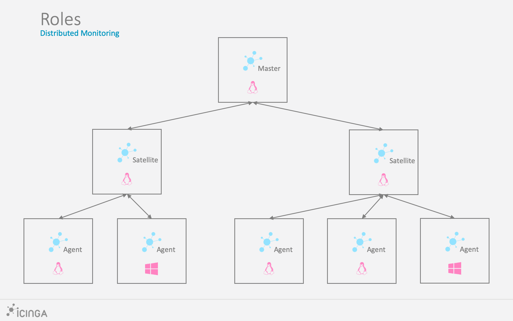

Rephrasing this picture into more details:

* A `master` node has no parent node.
    * A `master`node is where you usually install Icinga Web 2.
    * A `master` node can combine executed checks from child nodes into backends and notifications.
* A `satellite` node has a parent and a child node.
    * A `satellite` node may execute checks on its own or delegate check execution to child nodes.
    * A `satellite` node can receive configuration for hosts/services, etc. from the parent node.
    * A `satellite` node continues to run even if the master node is temporarily unavailable.
* An `agent` node only has a parent node.
    * An `agent` node will either run its own configured checks or receive command execution events from the parent node.

A client can be a secondary master, a satellite or an agent. It
typically requests something from the primary master or parent node.

The following sections will refer to these roles and explain the
differences and the possibilities this kind of setup offers.

> **Note**
>
> Previous versions of this documentation used the term `Icinga client`.
> This has been refined into `Icinga agent` and is visible in the docs,
> backends and web interfaces.

**Tip**: If you just want to install a single master node that monitors several hosts
(i.e. Icinga agents), continue reading -- we'll start with
simple examples.
In case you are planning a huge cluster setup with multiple levels and
lots of satellites and agents, read on -- we'll deal with these cases later on.

The installation on each system is the same: You need to install the
[Icinga 2 package](02-installation.md#setting-up-icinga2) and the required [plugins](02-installation.md#setting-up-check-plugins).

The required configuration steps are mostly happening
on the command line. You can also [automate the setup](06-distributed-monitoring.md#distributed-monitoring-automation).

The first thing you need learn about a distributed setup is the hierarchy of the single components.

## Zones <a id="distributed-monitoring-zones"></a>

The Icinga 2 hierarchy consists of so-called [zone](09-object-types.md#objecttype-zone) objects.
Zones depend on a parent-child relationship in order to trust each other.


Have a look at this example for the `satellite` zones which have the `master` zone as a parent zone:

```
object Zone "master" {
   //...
}

object Zone "satellite region 1" {
  parent = "master"
  //...
}

object Zone "satellite region 2" {
  parent = "master"
  //...
}
```

There are certain limitations for child zones, e.g. their members are not allowed
to send configuration commands to the parent zone members. Vice versa, the
trust hierarchy allows for example the `master` zone to send
configuration files to the `satellite` zone. Read more about this
in the [security section](06-distributed-monitoring.md#distributed-monitoring-security).

`agent` nodes also have their own unique zone. By convention you
must use the FQDN for the zone name.

## Endpoints <a id="distributed-monitoring-endpoints"></a>

Nodes which are a member of a zone are so-called [Endpoint](09-object-types.md#objecttype-endpoint) objects.

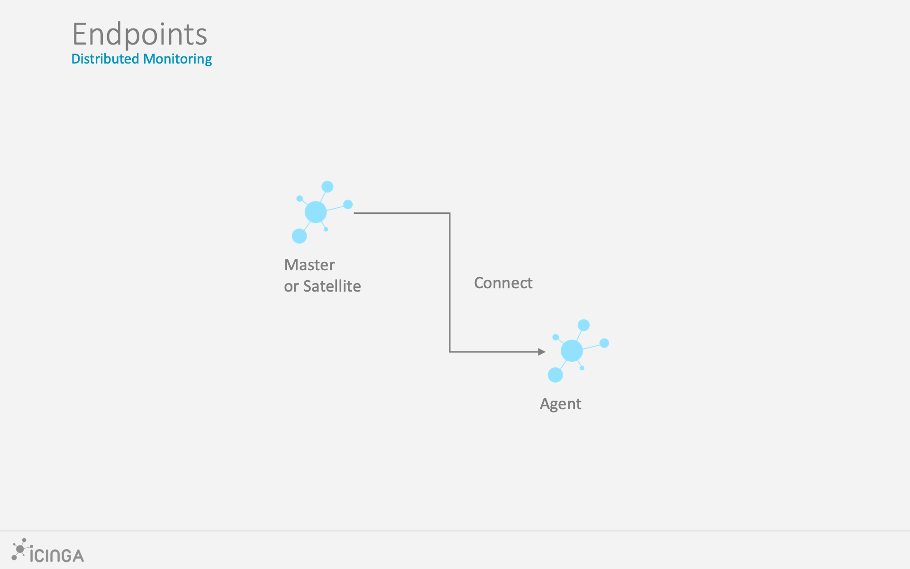

Here is an example configuration for two endpoints in different zones:

```
object Endpoint "icinga2-master1.localdomain" {
  host = "192.168.56.101"
}

object Endpoint "icinga2-satellite1.localdomain" {
  host = "192.168.56.105"
}

object Zone "master" {
  endpoints = [ "icinga2-master1.localdomain" ]
}

object Zone "satellite" {
  endpoints = [ "icinga2-satellite1.localdomain" ]
  parent = "master"
}
```

All endpoints in the same zone work as high-availability setup. For
example, if you have two nodes in the `master` zone, they will load-balance the check execution.

Endpoint objects are important for specifying the connection
information, e.g. if the master should actively try to connect to an agent.

The zone membership is defined inside the `Zone` object definition using
the `endpoints` attribute with an array of `Endpoint` names.

> **Note**
>
> There is a known [problem](https://github.com/Icinga/icinga2/issues/3533)
> with >2 endpoints in a zone and a message routing loop.
> The config validation will log a warning to let you know about this too.

If you want to check the availability (e.g. ping checks) of the node
you still need a [Host](09-object-types.md#objecttype-host) object.

## ApiListener <a id="distributed-monitoring-apilistener"></a>

In case you are using the CLI commands later, you don't have to write
this configuration from scratch in a text editor.
The [ApiListener](09-object-types.md#objecttype-apilistener) object is
used to load the TLS certificates and specify restrictions, e.g.
for accepting configuration commands.

It is also used for the [Icinga 2 REST API](12-icinga2-api.md#icinga2-api) which shares
the same host and port with the Icinga 2 Cluster protocol.

The object configuration is stored in the `/etc/icinga2/features-enabled/api.conf`
file. Depending on the configuration mode the attributes `accept_commands`
and `accept_config` can be configured here.

In order to use the `api` feature you need to enable it and restart Icinga 2.

```
icinga2 feature enable api
```

## Conventions <a id="distributed-monitoring-conventions"></a>

By convention all nodes should be configured using their FQDN.

Furthermore, you must ensure that the following names
are exactly the same in all configuration files:

* Host certificate common name (CN).
* Endpoint configuration object for the host.
* NodeName constant for the local host.

Setting this up on the command line will help you to minimize the effort.
Just keep in mind that you need to use the FQDN for endpoints and for
common names when asked.

## Security <a id="distributed-monitoring-security"></a>

While there are certain mechanisms to ensure a secure communication between all
nodes (firewalls, policies, software hardening, etc.), Icinga 2 also provides
additional security:

* TLS v1.2+ is required.
* TLS cipher lists are hardened [by default](09-object-types.md#objecttype-apilistener).
* TLS certificates are mandatory for communication between nodes. The CLI command wizards
help you create these certificates.
* Child zones only receive updates (check results, commands, etc.) for their configured objects.
* Child zones are not allowed to push configuration updates to parent zones.
* Zones cannot interfere with other zones and influence each other. Each checkable host or service object is assigned to **one zone** only.
* All nodes in a zone trust each other.
* [Config sync](06-distributed-monitoring.md#distributed-monitoring-top-down-config-sync) and [remote command endpoint execution](06-distributed-monitoring.md#distributed-monitoring-top-down-command-endpoint) is disabled by default.

The underlying protocol uses JSON-RPC event notifications exchanged by nodes.
The connection is secured by TLS. The message protocol uses an internal API,
and as such message types and names may change internally and are not documented.

Zones build the trust relationship in a distributed environment. If you do not specify
a zone for an agent/satellite and specify the parent zone, its zone members e.g. the master instance
won't trust the agent/satellite.

Building this trust is key in your distributed environment. That way the parent node
knows that it is able to send messages to the child zone, e.g. configuration objects,
configuration in global zones, commands to be executed in this zone/for this endpoint.
It also receives check results from the child zone for checkable objects (host/service).

Vice versa, the agent/satellite trusts the master and accepts configuration and commands if enabled
in the api feature. If the agent/satellite would send configuration to the parent zone, the parent nodes
will deny it. The parent zone is the configuration entity, and does not trust agents/satellites in this matter.
An agent/satellite could attempt to modify a different agent/satellite for example, or inject a check command
with malicious code.

While it may sound complicated for agent/satellite setups, it removes the problem with different roles
and configurations for a master and child nodes. Both of them work the same way, are configured
in the same way (Zone, Endpoint, ApiListener), and you can troubleshoot and debug them in just one go.

## Versions and Upgrade <a id="distributed-monitoring-versions-upgrade"></a>

It generally is advised to use the newest releases with the same version on all instances.
Prior to upgrading, make sure to plan a maintenance window.

The Icinga project aims to allow the following compatibility:

```
master (2.11) >= satellite (2.10) >= agent (2.9)
```

Older agent versions may work, but there's no guarantee. Always keep in mind that
older versions are out of support and can contain bugs.

In terms of an upgrade, ensure that the master is upgraded first, then
involved satellites, and last the Icinga agents. If you are on v2.10
currently, first upgrade the master instance(s) to 2.11, and then proceed
with the satellites. Things are getting easier with any sort of automation
tool (Puppet, Ansible, etc.).

Releases and new features may require you to upgrade master/satellite instances at once,
this is highlighted in the [upgrading docs](16-upgrading-icinga-2.md#upgrading-icinga-2) if needed.
One example is the CA Proxy and on-demand signing feature
available since v2.8 where all involved instances need this version
to function properly.

## Master Setup <a id="distributed-monitoring-setup-master"></a>

This section explains how to install a central single master node using
the `node wizard` command. If you prefer to do an automated installation, please
refer to the [automated setup](06-distributed-monitoring.md#distributed-monitoring-automation) section.

Install the [Icinga 2 package](02-installation.md#setting-up-icinga2) and setup
the required [plugins](02-installation.md#setting-up-check-plugins) if you haven't done
so already.

**Note**: Windows is not supported for a master node setup.

The next step is to run the `node wizard` CLI command. Prior to that
ensure to collect the required information:

  Parameter           | Description
  --------------------|--------------------
  Common name (CN)    | **Required.** By convention this should be the host's FQDN. Defaults to the FQDN.
  Master zone name    | **Optional.** Allows to specify the master zone name. Defaults to `master`.
  Global zones        | **Optional.** Allows to specify more global zones in addition to `global-templates` and `director-global`. Defaults to `n`.
  API bind host       | **Optional.** Allows to specify the address the ApiListener is bound to. For advanced usage only.
  API bind port       | **Optional.** Allows to specify the port the ApiListener is bound to. For advanced usage only (requires changing the default port 5665 everywhere).
  Disable conf.d      | **Optional.** Allows to disable the `include_recursive "conf.d"` directive except for the `api-users.conf` file in the `icinga2.conf` file. Defaults to `y`. Configuration on the master is discussed below.

The setup wizard will ensure that the following steps are taken:

* Enable the `api` feature.
* Generate a new certificate authority (CA) in `/var/lib/icinga2/ca` if it doesn't exist.
* Create a certificate for this node signed by the CA key.
* Update the [zones.conf](04-configuration.md#zones-conf) file with the new zone hierarchy.
* Update the [ApiListener](06-distributed-monitoring.md#distributed-monitoring-apilistener) and [constants](04-configuration.md#constants-conf) configuration.
* Update the [icinga2.conf](04-configuration.md#icinga2-conf) to disable the `conf.d` inclusion, and add the `api-users.conf` file inclusion.

Here is an example of a master setup for the `icinga2-master1.localdomain` node on CentOS 7:

```
[root@icinga2-master1.localdomain /]# icinga2 node wizard

Welcome to the Icinga 2 Setup Wizard!

We will guide you through all required configuration details.

Please specify if this is a satellite/agent setup ('n' installs a master setup) [Y/n]: n

Starting the Master setup routine...

Please specify the common name (CN) [icinga2-master1.localdomain]: icinga2-master1.localdomain
Reconfiguring Icinga...
Checking for existing certificates for common name 'icinga2-master1.localdomain'...
Certificates not yet generated. Running 'api setup' now.
Generating master configuration for Icinga 2.
Enabling feature api. Make sure to restart Icinga 2 for these changes to take effect.

Master zone name [master]:

Default global zones: global-templates director-global
Do you want to specify additional global zones? [y/N]: N

Please specify the API bind host/port (optional):
Bind Host []:
Bind Port []:

Do you want to disable the inclusion of the conf.d directory [Y/n]:
Disabling the inclusion of the conf.d directory...
Checking if the api-users.conf file exists...

Done.

Now restart your Icinga 2 daemon to finish the installation!
```

You can verify that the CA public and private keys are stored in the `/var/lib/icinga2/ca` directory.
Keep this path secure and include it in your [backups](02-installation.md#install-backup).

In case you lose the CA private key you have to generate a new CA for signing new agent/satellite
certificate requests. You then have to also re-create new signed certificates for all
existing nodes.

Once the master setup is complete, you can also use this node as primary [CSR auto-signing](06-distributed-monitoring.md#distributed-monitoring-setup-csr-auto-signing)
master. The following section will explain how to use the CLI commands in order to fetch their
signed certificate from this master node.

## Signing Certificates on the Master <a id="distributed-monitoring-setup-sign-certificates-master"></a>

All certificates must be signed by the same certificate authority (CA). This ensures
that all nodes trust each other in a distributed monitoring environment.

This CA is generated during the [master setup](06-distributed-monitoring.md#distributed-monitoring-setup-master)
and should be the same on all master instances.

You can avoid signing and deploying certificates [manually](06-distributed-monitoring.md#distributed-monitoring-advanced-hints-certificates-manual)
by using built-in methods for auto-signing certificate signing requests (CSR):

* [CSR Auto-Signing](06-distributed-monitoring.md#distributed-monitoring-setup-csr-auto-signing) which uses a client (an agent or a satellite) ticket generated on the master as trust identifier.
* [On-Demand CSR Signing](06-distributed-monitoring.md#distributed-monitoring-setup-on-demand-csr-signing) which allows to sign pending certificate requests on the master.

Both methods are described in detail below.

> **Note**
>
> [On-Demand CSR Signing](06-distributed-monitoring.md#distributed-monitoring-setup-on-demand-csr-signing) is available in Icinga 2 v2.8+.

### CSR Auto-Signing <a id="distributed-monitoring-setup-csr-auto-signing"></a>

A client can be a secondary master, a satellite or an agent. It sends a certificate signing request (CSR)
and must authenticate itself in a trusted way. The master generates a client ticket which is included in this request.
That way the master can verify that the request matches the previously trusted ticket
and sign the request.

> **Note**
>
> Icinga 2 v2.8 added the possibility to forward signing requests on a satellite
> to the master node. This is called `CA Proxy` in blog posts and design drafts.
> This functionality helps with the setup of [three level clusters](06-distributed-monitoring.md#distributed-monitoring-scenarios-master-satellite-agents)
> and more.

Advantages:

* Nodes (secondary master, satellites, agents) can be installed by different users who have received the client ticket.
* No manual interaction necessary on the master node.
* Automation tools like Puppet, Ansible, etc. can retrieve the pre-generated ticket in their client catalog
and run the node setup directly.

Disadvantages:

* Tickets need to be generated on the master and copied to client setup wizards.
* No central signing management.

#### CSR Auto-Signing: Preparation <a id="distributed-monitoring-setup-csr-auto-signing-preparation"></a>

Prior to using this mode, ensure that the following steps are taken on
the signing master:

* The [master setup](06-distributed-monitoring.md#distributed-monitoring-setup-master) was run successfully. This includes:
    * Generated a CA key pair
    * Generated a private ticket salt stored in the `TicketSalt` constant, set as `ticket_salt` attribute inside the [api](09-object-types.md#objecttype-apilistener) feature.
* Restart of the master instance.

#### CSR Auto-Signing: On the master <a id="distributed-monitoring-setup-csr-auto-signing-master"></a>

Setup wizards for agent/satellite nodes will ask you for this specific client ticket.

There are two possible ways to retrieve the ticket:

* [CLI command](11-cli-commands.md#cli-command-pki) executed on the master node.
* [REST API](12-icinga2-api.md#icinga2-api) request against the master node.


Required information:

  Parameter           | Description
  --------------------|--------------------
  Common name (CN)    | **Required.** The common name for the agent/satellite. By convention this should be the FQDN.

The following example shows how to generate a ticket on the master node `icinga2-master1.localdomain` for the agent `icinga2-agent1.localdomain`:

```
[root@icinga2-master1.localdomain /]# icinga2 pki ticket --cn icinga2-agent1.localdomain
```

Querying the [Icinga 2 API](12-icinga2-api.md#icinga2-api) on the master requires an [ApiUser](12-icinga2-api.md#icinga2-api-authentication)
object with at least the `actions/generate-ticket` permission.

```
[root@icinga2-master1.localdomain /]# vim /etc/icinga2/conf.d/api-users.conf

object ApiUser "client-pki-ticket" {
  password = "bea11beb7b810ea9ce6ea" //change this
  permissions = [ "actions/generate-ticket" ]
}

[root@icinga2-master1.localdomain /]# systemctl restart icinga2

Retrieve the ticket on the master node `icinga2-master1.localdomain` with `curl`, for example:

 [root@icinga2-master1.localdomain /]# curl -k -s -u client-pki-ticket:bea11beb7b810ea9ce6ea -H 'Accept: application/json' \
 -X POST 'https://localhost:5665/v1/actions/generate-ticket' -d '{ "cn": "icinga2-agent1.localdomain" }'
```

Store that ticket number for the [agent/satellite setup](06-distributed-monitoring.md#distributed-monitoring-setup-agent-satellite) below.

> **Note**
>
> Never expose the ticket salt and/or ApiUser credentials to your client nodes.
> Example: Retrieve the ticket on the Puppet master node and send the compiled catalog
> to the authorized Puppet agent node which will invoke the
> [automated setup steps](06-distributed-monitoring.md#distributed-monitoring-automation-cli-node-setup).


### On-Demand CSR Signing <a id="distributed-monitoring-setup-on-demand-csr-signing"></a>

The client can be a secondary master, satellite or agent.
It sends a certificate signing request to specified parent node without any
ticket. The admin on the primary master is responsible for reviewing and signing the requests
with the private CA key.

This could either be directly the master, or a satellite which forwards the request
to the signing master.

Advantages:

* Central certificate request signing management.
* No pre-generated ticket is required for client setups.

Disadvantages:

* Asynchronous step for automated deployments.
* Needs client verification on the master.

#### On-Demand CSR Signing: Preparation <a id="distributed-monitoring-setup-on-demand-csr-signing-preparation"></a>

Prior to using this mode, ensure that the following steps are taken on
the signing master:

* The [master setup](06-distributed-monitoring.md#distributed-monitoring-setup-master) was run successfully. This includes:
    * Generated a CA key pair
* Restart of the master instance.

#### On-Demand CSR Signing: On the master <a id="distributed-monitoring-setup-on-demand-csr-signing-master"></a>

You can list pending certificate signing requests with the `ca list` CLI command.

```
[root@icinga2-master1.localdomain /]# icinga2 ca list
Fingerprint                                                      | Timestamp           | Signed | Subject
-----------------------------------------------------------------|---------------------|--------|--------
71700c28445109416dd7102038962ac3fd421fbb349a6e7303b6033ec1772850 | 2017/09/06 17:20:02 |        | CN = icinga2-agent2.localdomain
```

In order to show all requests, use the `--all` parameter.

```
[root@icinga2-master1.localdomain /]# icinga2 ca list --all
Fingerprint                                                      | Timestamp           | Signed | Subject
-----------------------------------------------------------------|---------------------|--------|--------
403da5b228df384f07f980f45ba50202529cded7c8182abf96740660caa09727 | 2017/09/06 17:02:40 | *      | CN = icinga2-agent1.localdomain
71700c28445109416dd7102038962ac3fd421fbb349a6e7303b6033ec1772850 | 2017/09/06 17:20:02 |        | CN = icinga2-agent2.localdomain
```

**Tip**: Add `--json` to the CLI command to retrieve the details in JSON format.

If you want to sign a specific request, you need to use the `ca sign` CLI command
and pass its fingerprint as argument.

```
[root@icinga2-master1.localdomain /]# icinga2 ca sign 71700c28445109416dd7102038962ac3fd421fbb349a6e7303b6033ec1772850
information/cli: Signed certificate for 'CN = icinga2-agent2.localdomain'.
```

> **Note**
>
> `ca list` cannot be used as historical inventory. Certificate
> signing requests older than 1 week are automatically deleted.

You can also remove an undesired CSR using the `ca remove` command using the
syntax as the `ca sign` command.

```
[root@pym ~]# icinga2 ca remove 5c31ca0e2269c10363a97e40e3f2b2cd56493f9194d5b1852541b835970da46e
information/cli: Certificate 5c31ca0e2269c10363a97e40e3f2b2cd56493f9194d5b1852541b835970da46e removed.
```
If you want to restore a certificate you have removed, you can use `ca restore`.

<!-- Keep this for compatibility -->
<a id="distributed-monitoring-setup-satellite-client"></a>

## Agent/Satellite Setup <a id="distributed-monitoring-setup-agent-satellite"></a>

This section describes the setup of an agent or satellite connected to an
existing master node setup. If you haven't done so already, please [run the master setup](06-distributed-monitoring.md#distributed-monitoring-setup-master).

Icinga 2 on the master node must be running and accepting connections on port `5665`.

<!-- Keep this for compatibility -->
<a id="distributed-monitoring-setup-client-linux"></a>

### Agent/Satellite Setup on Linux <a id="distributed-monitoring-setup-agent-satellite-linux"></a>

Please ensure that you've run all the steps mentioned in the [agent/satellite section](06-distributed-monitoring.md#distributed-monitoring-setup-agent-satellite).

Install the [Icinga 2 package](02-installation.md#setting-up-icinga2) and setup
the required [plugins](02-installation.md#setting-up-check-plugins) if you haven't done
so already.

The next step is to run the `node wizard` CLI command.

In this example we're generating a ticket on the master node `icinga2-master1.localdomain` for the agent `icinga2-agent1.localdomain`:

```
[root@icinga2-master1.localdomain /]# icinga2 pki ticket --cn icinga2-agent1.localdomain
4f75d2ecd253575fe9180938ebff7cbca262f96e
```

Note: You don't need this step if you have chosen to use [On-Demand CSR Signing](06-distributed-monitoring.md#distributed-monitoring-setup-on-demand-csr-signing).

Start the wizard on the agent `icinga2-agent1.localdomain`:

```
[root@icinga2-agent1.localdomain /]# icinga2 node wizard

Welcome to the Icinga 2 Setup Wizard!

We will guide you through all required configuration details.
```

Press `Enter` or add `y` to start a satellite or agent setup.

```
Please specify if this is an agent/satellite setup ('n' installs a master setup) [Y/n]:
```

Press `Enter` to use the proposed name in brackets, or add a specific common name (CN). By convention
this should be the FQDN.

```
Starting the Agent/Satellite setup routine...

Please specify the common name (CN) [icinga2-agent1.localdomain]: icinga2-agent1.localdomain
```

Specify the direct parent for this node. This could be your primary master `icinga2-master1.localdomain`
or a satellite node in a multi level cluster scenario.

```
Please specify the parent endpoint(s) (master or satellite) where this node should connect to:
Master/Satellite Common Name (CN from your master/satellite node): icinga2-master1.localdomain
```

Press `Enter` or choose `y` to establish a connection to the parent node.

```
Do you want to establish a connection to the parent node from this node? [Y/n]:
```

> **Note:**
>
> If this node cannot connect to the parent node, choose `n`. The setup
> wizard will provide instructions for this scenario -- signing questions are disabled then.

Add the connection details for `icinga2-master1.localdomain`.

```
Please specify the master/satellite connection information:
Master/Satellite endpoint host (IP address or FQDN): 192.168.56.101
Master/Satellite endpoint port [5665]: 5665
```

You can add more parent nodes if necessary. Press `Enter` or choose `n`
if you don't want to add any. This comes in handy if you have more than one
parent node, e.g. two masters or two satellites.

```
Add more master/satellite endpoints? [y/N]:
```

Verify the parent node's certificate:

```
Parent certificate information:

 Subject:     CN = icinga2-master1.localdomain
 Issuer:      CN = Icinga CA
 Valid From:  Sep  7 13:41:24 2017 GMT
 Valid Until: Sep  3 13:41:24 2032 GMT
 Fingerprint: AC 99 8B 2B 3D B0 01 00 E5 21 FA 05 2E EC D5 A9 EF 9E AA E3

Is this information correct? [y/N]: y
```

The setup wizard fetches the parent node's certificate and ask
you to verify this information. This is to prevent MITM attacks or
any kind of untrusted parent relationship.

Note: The certificate is not fetched if you have chosen not to connect
to the parent node.

Proceed with adding the optional client ticket for [CSR auto-signing](06-distributed-monitoring.md#distributed-monitoring-setup-csr-auto-signing):

```
Please specify the request ticket generated on your Icinga 2 master (optional).
 (Hint: # icinga2 pki ticket --cn 'icinga2-agent1.localdomain'):
4f75d2ecd253575fe9180938ebff7cbca262f96e
```

In case you've chosen to use [On-Demand CSR Signing](06-distributed-monitoring.md#distributed-monitoring-setup-on-demand-csr-signing)
you can leave the ticket question blank.

Instead, Icinga 2 tells you to approve the request later on the master node.

```
No ticket was specified. Please approve the certificate signing request manually
on the master (see 'icinga2 ca list' and 'icinga2 ca sign --help' for details).
```

You can optionally specify a different bind host and/or port.

```
Please specify the API bind host/port (optional):
Bind Host []:
Bind Port []:
```

The next step asks you to accept configuration (required for [config sync mode](06-distributed-monitoring.md#distributed-monitoring-top-down-config-sync))
and commands (required for [command endpoint mode](06-distributed-monitoring.md#distributed-monitoring-top-down-command-endpoint)).

```
Accept config from parent node? [y/N]: y
Accept commands from parent node? [y/N]: y
```

Next you can optionally specify the local and parent zone names. This will be reflected
in the generated zone configuration file.

Set the local zone name to something else, if you are installing a satellite or secondary master instance.

```
Local zone name [icinga2-agent1.localdomain]:
```

Set the parent zone name to something else than `master` if this agents connects to a satellite instance instead of the master.

```
Parent zone name [master]:
```

You can add more global zones in addition to `global-templates` and `director-global` if necessary.
Press `Enter` or choose `n`, if you don't want to add any additional.

```
Reconfiguring Icinga...

Default global zones: global-templates director-global
Do you want to specify additional global zones? [y/N]: N
```

Last but not least the wizard asks you whether you want to disable the inclusion of the local configuration
directory in `conf.d`, or not. Defaults to disabled, as agents either are checked via command endpoint, or
they receive configuration synced from the parent zone.

```
Do you want to disable the inclusion of the conf.d directory [Y/n]: Y
Disabling the inclusion of the conf.d directory...
```


The wizard proceeds and you are good to go.

```
Done.

Now restart your Icinga 2 daemon to finish the installation!
```

> **Note**
>
> If you have chosen not to connect to the parent node, you cannot start
> Icinga 2 yet. The wizard asked you to manually copy the master's public
> CA certificate file into `/var/lib/icinga2/certs/ca.crt`.
>
> You need to manually sign the CSR on the master node.

Restart Icinga 2 as requested.

```
[root@icinga2-agent1.localdomain /]# systemctl restart icinga2
```

Here is an overview of all parameters in detail:

  Parameter           | Description
  --------------------|--------------------
  Common name (CN)    | **Required.** By convention this should be the host's FQDN. Defaults to the FQDN.
  Master common name  | **Required.** Use the common name you've specified for your master node before.
  Establish connection to the parent node | **Optional.** Whether the node should attempt to connect to the parent node or not. Defaults to `y`.
  Master/Satellite endpoint host | **Required if the the agent needs to connect to the master/satellite.** The parent endpoint's IP address or FQDN. This information is included in the `Endpoint` object configuration in the `zones.conf` file.
  Master/Satellite endpoint port | **Optional if the the agent needs to connect to the master/satellite.** The parent endpoints's listening port. This information is included in the `Endpoint` object configuration.
  Add more master/satellite endpoints | **Optional.** If you have multiple master/satellite nodes configured, add them here.
  Parent Certificate information | **Required.** Verify that the connecting host really is the requested master node.
  Request ticket      | **Optional.** Add the [ticket](06-distributed-monitoring.md#distributed-monitoring-setup-csr-auto-signing) generated on the master.
  API bind host       | **Optional.** Allows to specify the address the ApiListener is bound to. For advanced usage only.
  API bind port       | **Optional.** Allows to specify the port the ApiListener is bound to. For advanced usage only (requires changing the default port 5665 everywhere).
  Accept config       | **Optional.** Whether this node accepts configuration sync from the master node (required for [config sync mode](06-distributed-monitoring.md#distributed-monitoring-top-down-config-sync)). For [security reasons](06-distributed-monitoring.md#distributed-monitoring-security) this defaults to `n`.
  Accept commands     | **Optional.** Whether this node accepts command execution messages from the master node (required for [command endpoint mode](06-distributed-monitoring.md#distributed-monitoring-top-down-command-endpoint)). For [security reasons](06-distributed-monitoring.md#distributed-monitoring-security) this defaults to `n`.
  Local zone name     | **Optional.** Allows to specify the name for the local zone. This comes in handy when this instance is a satellite, not an agent. Defaults to the FQDN.
  Parent zone name    | **Optional.** Allows to specify the name for the parent zone. This is important if the agent has a satellite instance as parent, not the master. Defaults to `master`.
  Global zones        | **Optional.** Allows to specify more global zones in addition to `global-templates` and `director-global`. Defaults to `n`.
  Disable conf.d      | **Optional.** Allows to disable the inclusion of the `conf.d` directory which holds local example configuration. Clients should retrieve their configuration from the parent node, or act as command endpoint execution bridge. Defaults to `y`.

The setup wizard will ensure that the following steps are taken:

* Enable the `api` feature.
* Create a certificate signing request (CSR) for the local node.
* Request a signed certificate i(optional with the provided ticket number) on the master node.
* Allow to verify the parent node's certificate.
* Store the signed agent/satellite certificate and ca.crt in `/var/lib/icinga2/certs`.
* Update the `zones.conf` file with the new zone hierarchy.
* Update `/etc/icinga2/features-enabled/api.conf` (`accept_config`, `accept_commands`) and `constants.conf`.
* Update `/etc/icinga2/icinga2.conf` and comment out `include_recursive "conf.d"`.

You can verify that the certificate files are stored in the `/var/lib/icinga2/certs` directory.

> **Note**
>
> If the agent is not directly connected to the certificate signing master,
> signing requests and responses might need some minutes to fully update the agent certificates.
>
> If you have chosen to use [On-Demand CSR Signing](06-distributed-monitoring.md#distributed-monitoring-setup-on-demand-csr-signing)
> certificates need to be signed on the master first. Ticket-less setups require at least Icinga 2 v2.8+ on all involved instances.

Now that you've successfully installed a Linux/Unix agent/satellite instance, please proceed to
the [configuration modes](06-distributed-monitoring.md#distributed-monitoring-configuration-modes).


<!-- Keep this for compatibility -->
<a id="distributed-monitoring-setup-client-windows"></a>

### Agent Setup on Windows <a id="distributed-monitoring-setup-agent-windows"></a>

#### Agent Setup on Windows: Installer <a id="distributed-monitoring-setup-agent-windows-installer"></a>

Download the MSI-Installer package from [https://packages.icinga.com/windows/](https://packages.icinga.com/windows/).

Requirements:

* Windows Vista/Server 2008 or higher
* [Microsoft .NET Framework 4.6](https://www.microsoft.com/en-US/download/details.aspx?id=53344) or higher for the setup wizard
* Versions older than Windows 10/Server 2016 require the [Universal C Runtime for Windows](https://support.microsoft.com/en-us/help/2999226/update-for-universal-c-runtime-in-windows)

The installer package includes the [NSClient++](https://www.nsclient.org/) package
so that Icinga 2 can use its built-in plugins. You can find more details in
[this chapter](06-distributed-monitoring.md#distributed-monitoring-windows-nscp).
The Windows package also installs native [monitoring plugin binaries](06-distributed-monitoring.md#distributed-monitoring-windows-plugins)
to get you started more easily.

> **Note**
>
> Please note that Icinga 2 was designed to run as light-weight agent on Windows.
> There is no support for satellite instances.

Run the MSI-Installer package and follow the instructions shown in the screenshots.

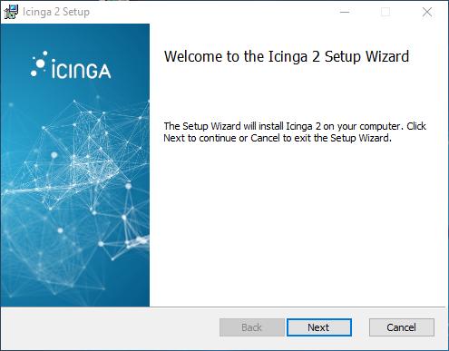
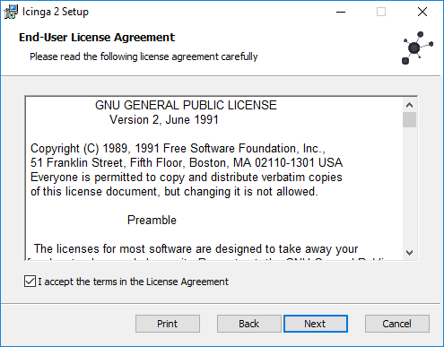
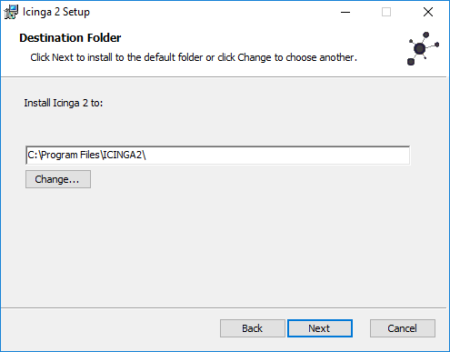

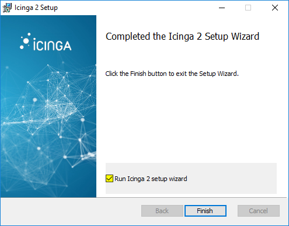

The graphical installer offers to run the [Icinga Agent setup wizard](06-distributed-monitoring.md#distributed-monitoring-setup-agent-windows-configuration-wizard)
after the installation. Select the check box to proceed.

> **Tip**
>
> You can also run the Icinga agent setup wizard from the Start menu later.

#### Agent Setup on Windows: Configuration Wizard <a id="distributed-monitoring-setup-agent-windows-configuration-wizard"></a>

On a fresh installation the setup wizard guides you through the initial configuration.
It also provides a mechanism to send a certificate request to the [CSR signing master](distributed-monitoring-setup-sign-certificates-master).

The following configuration details are required:

  Parameter           | Description
  --------------------|--------------------
  Instance name       | **Required.** By convention this should be the host's FQDN. Defaults to the FQDN.
  Setup ticket        | **Optional.** Paste the previously generated [ticket number](06-distributed-monitoring.md#distributed-monitoring-setup-csr-auto-signing). If left blank, the certificate request must be [signed on the master node](06-distributed-monitoring.md#distributed-monitoring-setup-on-demand-csr-signing).

Fill in the required information and click `Add` to add a new master connection.

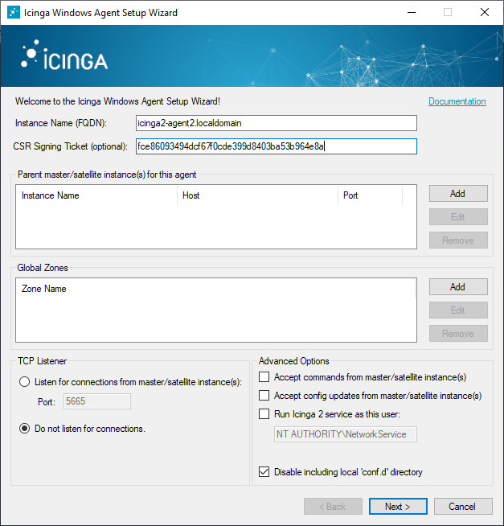

Add the following details:

  Parameter                      | Description
  -------------------------------|-------------------------------
  Instance name                  | **Required.** The master/satellite endpoint name where this agent is a direct child of.
  Master/Satellite endpoint host | **Required.** The master or satellite's IP address or FQDN. This information is included in the `Endpoint` object configuration in the `zones.conf` file.
  Master/Satellite endpoint port | **Optional.** The master or satellite's listening port. This information is included in the `Endpoint` object configuration.


When needed you can add an additional global zone (the zones `global-templates` and `director-global` are added by default):

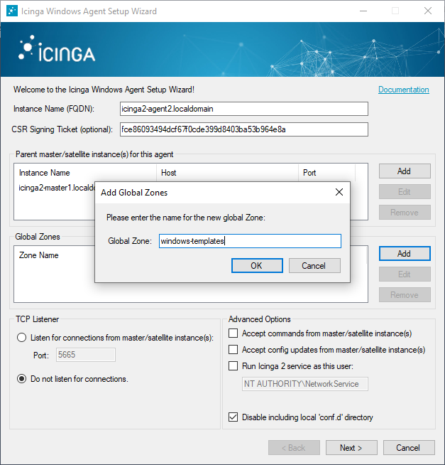

Optionally enable the following settings:

  Parameter                                               | Description
  --------------------------------------------------------|----------------------------------
  Accept commands from master/satellite instance(s)       | **Optional.** Whether this node accepts command execution messages from the master node (required for [command endpoint mode](06-distributed-monitoring.md#distributed-monitoring-top-down-command-endpoint)). For [security reasons](06-distributed-monitoring.md#distributed-monitoring-security) this is disabled by default.
  Accept config updates from master/satellite instance(s) | **Optional.** Whether this node accepts configuration sync from the master node (required for [config sync mode](06-distributed-monitoring.md#distributed-monitoring-top-down-config-sync)). For [security reasons](06-distributed-monitoring.md#distributed-monitoring-security) this is disabled by default.
  Run Icinga 2 service as this user                       | **Optional.** Specify a different Windows user. This defaults to `NT AUTHORITY\Network Service` and is required for more privileged service checks.
  Install/Update bundled NSClient++                       | **Optional.** The Windows installer bundles the NSClient++ installer for additional [plugin checks](06-distributed-monitoring.md#distributed-monitoring-windows-nscp).
  Disable including local 'conf.d' directory              | **Optional.** Allows to disable the `include_recursive "conf.d"` directive except for the `api-users.conf` file in the `icinga2.conf` file. Defaults to `true`.


Verify the certificate from the master/satellite instance where this node should connect to.

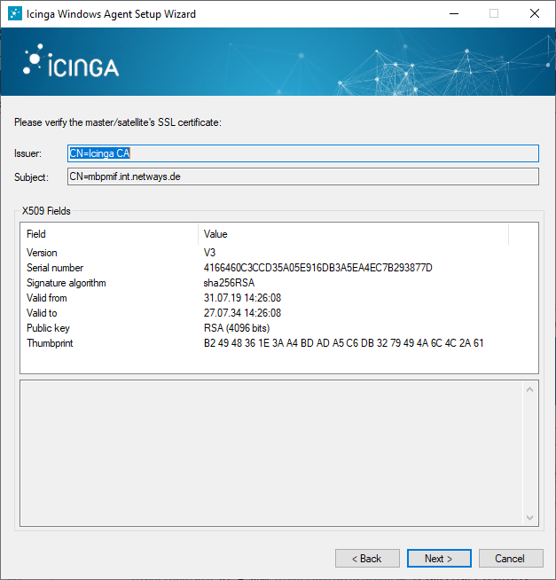


#### Bundled NSClient++ Setup <a id="distributed-monitoring-setup-agent-windows-nsclient"></a>

If you have chosen to install/update the NSClient++ package, the Icinga 2 setup wizard asks
you to do so.


Choose the `Generic` setup.


Choose the `Custom` setup type.


NSClient++ does not install a sample configuration by default. Change this as shown in the screenshot.


Generate a secure password and enable the web server module. **Note**: The webserver module is
available starting with NSClient++ 0.5.0. Icinga 2 v2.6+ is required which includes this version.


Finish the installation.


Open a web browser and navigate to `https://localhost:8443`. Enter the password you've configured
during the setup. In case you lost it, look into the `C:\Program Files\NSClient++\nsclient.ini`
configuration file.


The NSClient++ REST API can be used to query metrics. [check_nscp_api](06-distributed-monitoring.md#distributed-monitoring-windows-nscp-check-api)
uses this transport method.


#### Finish Windows Agent Setup <a id="distributed-monitoring-setup-agent-windows-finish"></a>

Finish the Windows setup wizard.

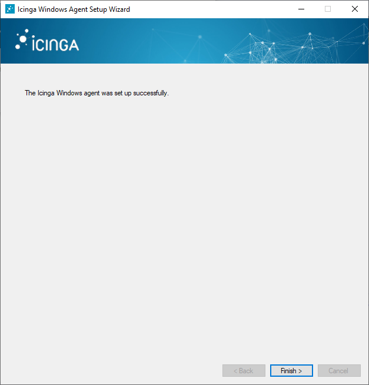

If you did not provide a setup ticket, you need to sign the certificate request on the master.
The setup wizards tells you to do so. The Icinga 2 service is running at this point already
and will automatically receive and update a signed client certificate.

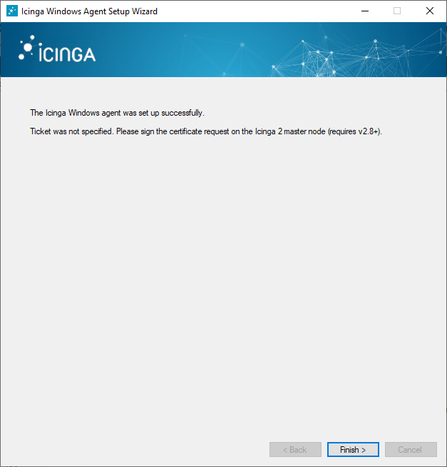

Icinga 2 is automatically started as a Windows service.


The Icinga 2 configuration is stored inside the `C:\ProgramData\icinga2` directory.
Click `Examine Config` in the setup wizard to open a new Explorer window.

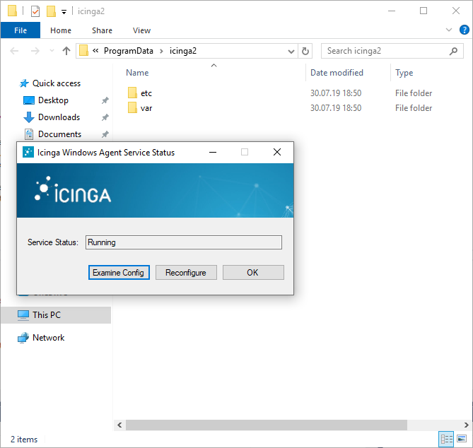

The configuration files can be modified with your favorite editor e.g. Notepad++ or vim in Powershell (via chocolatey).

In order to use the [top down](06-distributed-monitoring.md#distributed-monitoring-top-down) agent
configuration prepare the following steps.

You don't need any local configuration on the agent except for
CheckCommand definitions which can be synced using the global zone
above. Therefore disable the inclusion of the `conf.d` directory
in the `icinga2.conf` file.

Navigate to `C:\ProgramData\icinga2\etc\icinga2` and open
the `icinga2.conf` file in your preferred editor. Remove or comment (`//`)
the following line:

```
// Commented out, not required on an agent with top down mode
//include_recursive "conf.d"
```

> **Note**
>
> Packages >= 2.9 provide an option in the setup wizard to disable this.
> Defaults to disabled.

Validate the configuration on Windows open an administrator terminal
and run the following command:

```
C:\WINDOWS\system32>cd "C:\Program Files\ICINGA2\sbin"
C:\Program Files\ICINGA2\sbin>icinga2.exe daemon -C
```

**Note**: You have to run this command in a shell with `administrator` privileges.

Now you need to restart the Icinga 2 service. Run `services.msc` from the start menu
and restart the `icinga2` service. Alternatively, you can use the `net {start,stop}` CLI commands.


Now that you've successfully installed a Windows agent, please proceed to
the [detailed configuration modes](06-distributed-monitoring.md#distributed-monitoring-configuration-modes).


## Configuration Modes <a id="distributed-monitoring-configuration-modes"></a>

There are different ways to ensure that the Icinga 2 cluster nodes execute
checks, send notifications, etc.

The preferred method is to configure monitoring objects on the master
and distribute the configuration to satellites and agents.

The following chapters explain this in detail with hands-on manual configuration
examples. You should test and implement this once to fully understand how it works.

Once you are familiar with Icinga 2 and distributed monitoring, you
can start with additional integrations to manage and deploy your
configuration:

* [Icinga Director](https://icinga.com/docs/director/latest/) provides a web interface to manage configuration and also allows to sync imported resources (CMDB, PuppetDB, etc.)
* [Ansible Roles](https://github.com/Icinga/icinga2-ansible)
* [Puppet Module](https://github.com/Icinga/puppet-icinga2)
* [Chef Cookbook](https://github.com/Icinga/chef-icinga2)

More details can be found [here](13-addons.md#configuration-tools).

### Top Down <a id="distributed-monitoring-top-down"></a>

There are two different behaviors with check execution:

* Send a command execution event remotely: The scheduler still runs on the parent node.
* Sync the host/service objects directly to the child node: Checks are executed locally.

Again, technically it does not matter whether this is an `agent` or a `satellite`
which is receiving configuration or command execution events.

### Top Down Command Endpoint <a id="distributed-monitoring-top-down-command-endpoint"></a>

This mode forces the Icinga 2 node to execute commands remotely on a specified endpoint.
The host/service object configuration is located on the master/satellite and the agent only
needs the CheckCommand object definitions available.

Every endpoint has its own remote check queue. The amount of checks executed simultaneously
can be limited on the endpoint with the `MaxConcurrentChecks` constant defined in [constants.conf](04-configuration.md#constants-conf). Icinga 2 may discard check requests,
if the remote check queue is full.

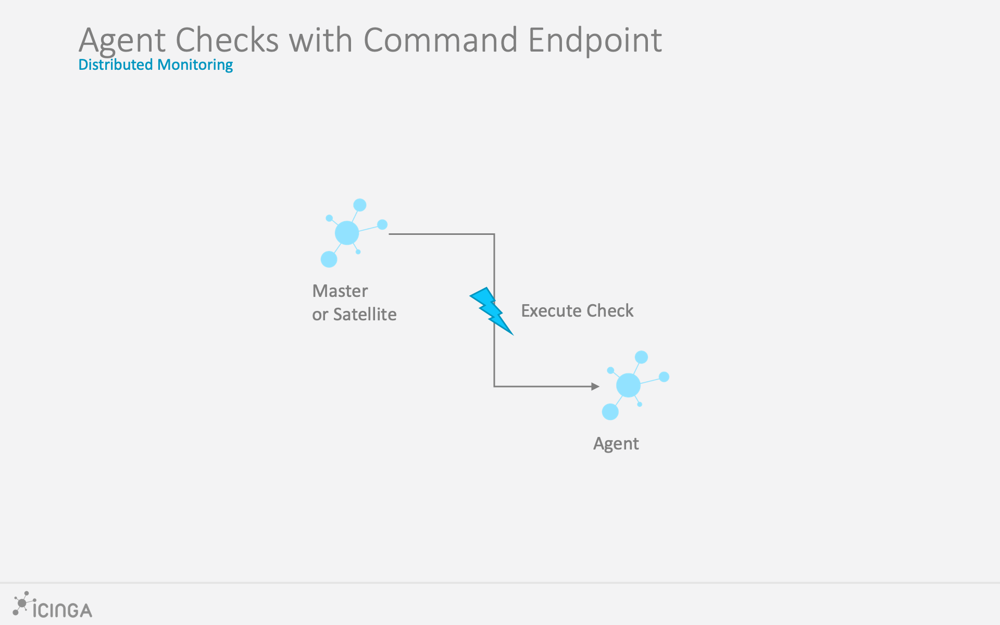

Advantages:

* No local checks need to be defined on the child node (agent).
* Light-weight remote check execution (asynchronous events).
* No [replay log](06-distributed-monitoring.md#distributed-monitoring-advanced-hints-command-endpoint-log-duration) is necessary for the child node.
* Pin checks to specific endpoints (if the child zone consists of 2 endpoints).

Disadvantages:

* If the child node is not connected, no more checks are executed.
* Requires additional configuration attribute specified in host/service objects.
* Requires local `CheckCommand` object configuration. Best practice is to use a [global config zone](06-distributed-monitoring.md#distributed-monitoring-global-zone-config-sync).

To make sure that all nodes involved will accept configuration and/or
commands, you need to configure the `Zone` and `Endpoint` hierarchy
on all nodes.

* `icinga2-master1.localdomain` is the configuration master in this scenario.
* `icinga2-agent1.localdomain` acts as agent which receives command execution messages via command endpoint from the master. In addition, it receives the global check command configuration from the master.

Include the endpoint and zone configuration on **both** nodes in the file `/etc/icinga2/zones.conf`.

The endpoint configuration could look like this, for example:

```
[root@icinga2-agent1.localdomain /]# vim /etc/icinga2/zones.conf

object Endpoint "icinga2-master1.localdomain" {
  host = "192.168.56.101"
}

object Endpoint "icinga2-agent1.localdomain" {
  host = "192.168.56.111"
  log_duration = 0 // Disable the replay log for command endpoint agents
}
```

Next, you need to define two zones. There is no naming convention, best practice is to either use `master`, `satellite`/`agent-fqdn` or to choose region names for example `Europe`, `USA` and `Asia`, though.

**Note**: Each agent requires its own zone and endpoint configuration. Best practice
is to use the agent's FQDN for all object names.

The `master` zone is a parent of the `icinga2-agent1.localdomain` zone:

```
[root@icinga2-agent1.localdomain /]# vim /etc/icinga2/zones.conf

object Zone "master" {
  endpoints = [ "icinga2-master1.localdomain" ] //array with endpoint names
}

object Zone "icinga2-agent1.localdomain" {
  endpoints = [ "icinga2-agent1.localdomain" ]

  parent = "master" //establish zone hierarchy
}
```

You don't need any local configuration on the agent except for
CheckCommand definitions which can be synced using the global zone
above. Therefore disable the inclusion of the `conf.d` directory
in `/etc/icinga2/icinga2.conf`.

```
[root@icinga2-agent1.localdomain /]# vim /etc/icinga2/icinga2.conf

// Commented out, not required on an agent as command endpoint
//include_recursive "conf.d"
```

> **Note**
>
> Packages >= 2.9 provide an option in the setup wizard to disable this.
> Defaults to disabled.

Now it is time to validate the configuration and to restart the Icinga 2 daemon
on both nodes.

Example on CentOS 7:

```
[root@icinga2-agent1.localdomain /]# icinga2 daemon -C
[root@icinga2-agent1.localdomain /]# systemctl restart icinga2

[root@icinga2-master1.localdomain /]# icinga2 daemon -C
[root@icinga2-master1.localdomain /]# systemctl restart icinga2
```

Once the agents have successfully connected, you are ready for the next step: **execute
a remote check on the agent using the command endpoint**.

Include the host and service object configuration in the `master` zone
-- this will help adding a secondary master for high-availability later.

```
[root@icinga2-master1.localdomain /]# mkdir -p /etc/icinga2/zones.d/master
```

Add the host and service objects you want to monitor. There is
no limitation for files and directories -- best practice is to
sort things by type.

By convention a master/satellite/agent host object should use the same name as the endpoint object.
You can also add multiple hosts which execute checks against remote services/agents.

The following example adds the `agent_endpoint` custom variable to the
host and stores its name (FQDN). _Versions older than 2.11
used the `client_endpoint` custom variable._

This custom variable serves two purposes: 1) Service apply rules can match against it.
2) Apply rules can retrieve its value and assign it to the `command_endpoint` attribute.

```
[root@icinga2-master1.localdomain /]# cd /etc/icinga2/zones.d/master
[root@icinga2-master1.localdomain /etc/icinga2/zones.d/master]# vim hosts.conf

object Host "icinga2-agent1.localdomain" {
  check_command = "hostalive" //check is executed on the master
  address = "192.168.56.111"

  vars.agent_endpoint = name //follows the convention that host name == endpoint name
}
```

Given that you are monitoring a Linux agent, add a remote [disk](10-icinga-template-library.md#plugin-check-command-disk)
check.

```
[root@icinga2-master1.localdomain /etc/icinga2/zones.d/master]# vim services.conf

apply Service "disk" {
  check_command = "disk"

  // Specify the remote agent as command execution endpoint, fetch the host custom variable
  command_endpoint = host.vars.agent_endpoint

  // Only assign where a host is marked as agent endpoint
  assign where host.vars.agent_endpoint
}
```

If you have your own custom `CheckCommand` definition, add it to the global zone:

```
[root@icinga2-master1.localdomain /]# mkdir -p /etc/icinga2/zones.d/global-templates
[root@icinga2-master1.localdomain /]# vim /etc/icinga2/zones.d/global-templates/commands.conf

object CheckCommand "my-cmd" {
  //...
}
```

Save the changes and validate the configuration on the master node:

```
[root@icinga2-master1.localdomain /]# icinga2 daemon -C
```
Restart the Icinga 2 daemon (example for CentOS 7):

```
[root@icinga2-master1.localdomain /]# systemctl restart icinga2
```

The following steps will happen:

* Icinga 2 validates the configuration on `icinga2-master1.localdomain` and restarts.
* The `icinga2-master1.localdomain` node schedules and executes the checks.
* The `icinga2-agent1.localdomain` node receives the execute command event with additional command parameters.
* The `icinga2-agent1.localdomain` node maps the command parameters to the local check command, executes the check locally, and sends back the check result message.

As you can see, no interaction from your side is required on the agent itself, and it's not necessary to reload the Icinga 2 service on the agent.

You have learned the basics about command endpoint checks. Proceed with
the [scenarios](06-distributed-monitoring.md#distributed-monitoring-scenarios)
section where you can find detailed information on extending the setup.


### Top Down Config Sync <a id="distributed-monitoring-top-down-config-sync"></a>

This mode syncs the object configuration files within specified zones.
It comes in handy if you want to configure everything on the master node
and sync the satellite checks (disk, memory, etc.). The satellites run their
own local scheduler and will send the check result messages back to the master.

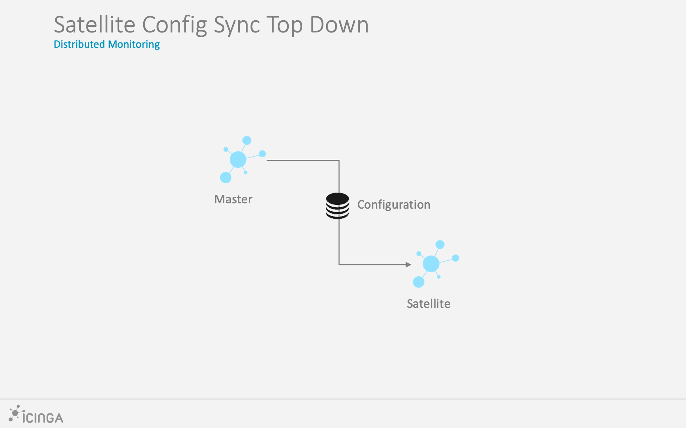

Advantages:

* Sync the configuration files from the parent zone to the child zones.
* No manual restart is required on the child nodes, as syncing, validation, and restarts happen automatically.
* Execute checks directly on the child node's scheduler.
* Replay log if the connection drops (important for keeping the check history in sync, e.g. for SLA reports).
* Use a global zone for syncing templates, groups, etc.

Disadvantages:

* Requires a config directory on the master node with the zone name underneath `/etc/icinga2/zones.d`.
* Additional zone and endpoint configuration needed.
* Replay log is replicated on reconnect after connection loss. This might increase the data transfer and create an overload on the connection.

> **Note**
>
> This mode only supports **configuration text files** for Icinga. Do not abuse
> this for syncing binaries, this is not supported and may harm your production
> environment. The config sync uses checksums to detect changes, binaries may
> trigger reload loops.
>
> This is a fair warning. If you want to deploy plugin binaries, create
> packages for dependency management and use infrastructure lifecycle tools
> such as Foreman, Puppet, Ansible, etc.

To make sure that all involved nodes accept configuration and/or
commands, you need to configure the `Zone` and `Endpoint` hierarchy
on all nodes.

* `icinga2-master1.localdomain` is the configuration master in this scenario.
* `icinga2-satellite1.localdomain` acts as satellite which receives configuration from the master. Checks are scheduled locally.

Include the endpoint and zone configuration on **both** nodes in the file `/etc/icinga2/zones.conf`.

The endpoint configuration could look like this:

```
[root@icinga2-satellite1.localdomain /]# vim /etc/icinga2/zones.conf

object Endpoint "icinga2-master1.localdomain" {
  host = "192.168.56.101"
}

object Endpoint "icinga2-satellite1.localdomain" {
  host = "192.168.56.105"
}
```

Next, you need to define two zones. There is no naming convention, best practice is to either use `master`, `satellite`/`agent-fqdn` or to choose region names for example `Europe`, `USA` and `Asia`, though.

The `master` zone is a parent of the `satellite` zone:

```
[root@icinga2-agent2.localdomain /]# vim /etc/icinga2/zones.conf

object Zone "master" {
  endpoints = [ "icinga2-master1.localdomain" ] //array with endpoint names
}

object Zone "satellite" {
  endpoints = [ "icinga2-satellite1.localdomain" ]

  parent = "master" //establish zone hierarchy
}
```

Edit the `api` feature on the satellite `icinga2-satellite1.localdomain` in
the `/etc/icinga2/features-enabled/api.conf` file and set
`accept_config` to `true`.

```
[root@icinga2-satellite1.localdomain /]# vim /etc/icinga2/features-enabled/api.conf

object ApiListener "api" {
   //...
   accept_config = true
}
```

Now it is time to validate the configuration and to restart the Icinga 2 daemon
on both nodes.

Example on CentOS 7:

```
[root@icinga2-satellite1.localdomain /]# icinga2 daemon -C
[root@icinga2-satellite1.localdomain /]# systemctl restart icinga2

[root@icinga2-master1.localdomain /]# icinga2 daemon -C
[root@icinga2-master1.localdomain /]# systemctl restart icinga2
```

**Tip**: Best practice is to use a [global zone](06-distributed-monitoring.md#distributed-monitoring-global-zone-config-sync)
for common configuration items (check commands, templates, groups, etc.).

Once the satellite(s) have connected successfully, it's time for the next step: **execute
a local check on the satellite using the configuration sync**.

Navigate to `/etc/icinga2/zones.d` on your master node
`icinga2-master1.localdomain` and create a new directory with the same
name as your satellite/agent zone name:

```
[root@icinga2-master1.localdomain /]# mkdir -p /etc/icinga2/zones.d/satellite
```

Add the host and service objects you want to monitor. There is
no limitation for files and directories -- best practice is to
sort things by type.

By convention a master/satellite/agent host object should use the same name as the endpoint object.
You can also add multiple hosts which execute checks against remote services/agents via [command endpoint](06-distributed-monitoring.md#distributed-monitoring-top-down-command-endpoint)
checks.

```
[root@icinga2-master1.localdomain /]# cd /etc/icinga2/zones.d/satellite
[root@icinga2-master1.localdomain /etc/icinga2/zones.d/satellite]# vim hosts.conf

object Host "icinga2-satellite1.localdomain" {
  check_command = "hostalive"
  address = "192.168.56.112"
  zone = "master" //optional trick: sync the required host object to the satellite, but enforce the "master" zone to execute the check
}
```

Given that you are monitoring a Linux satellite add a local [disk](10-icinga-template-library.md#plugin-check-command-disk)
check.

```
[root@icinga2-master1.localdomain /etc/icinga2/zones.d/satellite]# vim services.conf

object Service "disk" {
  host_name = "icinga2-satellite1.localdomain"

  check_command = "disk"
}
```

Save the changes and validate the configuration on the master node:

```
[root@icinga2-master1.localdomain /]# icinga2 daemon -C
```

Restart the Icinga 2 daemon (example for CentOS 7):

```
[root@icinga2-master1.localdomain /]# systemctl restart icinga2
```

The following steps will happen:

* Icinga 2 validates the configuration on `icinga2-master1.localdomain`.
* Icinga 2 copies the configuration into its zone config store in `/var/lib/icinga2/api/zones`.
* The `icinga2-master1.localdomain` node sends a config update event to all endpoints in the same or direct child zones.
* The `icinga2-satellite1.localdomain` node accepts config and populates the local zone config store with the received config files.
* The `icinga2-satellite1.localdomain` node validates the configuration and automatically restarts.

Again, there is no interaction required on the satellite itself.

You can also use the config sync inside a high-availability zone to
ensure that all config objects are synced among zone members.

**Note**: You can only have one so-called "config master" in a zone which stores
the configuration in the `zones.d` directory.
Multiple nodes with configuration files in the `zones.d` directory are
**not supported**.

Now that you've learned the basics about the configuration sync, proceed with
the [scenarios](06-distributed-monitoring.md#distributed-monitoring-scenarios)
section where you can find detailed information on extending the setup.


If you are eager to start fresh instead you might take a look into the
[Icinga Director](https://icinga.com/docs/director/latest/).

## Scenarios <a id="distributed-monitoring-scenarios"></a>

The following examples should give you an idea on how to build your own
distributed monitoring environment. We've seen them all in production
environments and received feedback from our [community](https://community.icinga.com/)
and [partner support](https://icinga.com/support/) channels:

* [Single master with agents](06-distributed-monitoring.md#distributed-monitoring-master-agents).
* [HA master with agents as command endpoint](06-distributed-monitoring.md#distributed-monitoring-scenarios-ha-master-agents)
* [Three level cluster](06-distributed-monitoring.md#distributed-monitoring-scenarios-master-satellite-agents) with config HA masters, satellites receiving config sync, and agents checked using command endpoint.

You can also extend the cluster tree depth to four levels e.g. with 2 satellite levels.
Just keep in mind that multiple levels become harder to debug in case of errors.

You can also start with a single master setup, and later add a secondary
master endpoint. This requires an extra step with the [initial sync](06-distributed-monitoring.md#distributed-monitoring-advanced-hints-initial-sync)
for cloning the runtime state. This is described in detail [here](06-distributed-monitoring.md#distributed-monitoring-scenarios-ha-master-agents).

<!-- Keep this for compatiblity -->
<a id="distributed-monitoring-master-clients"></a>

### Master with Agents <a id="distributed-monitoring-master-agents"></a>

In this scenario, a single master node runs the check scheduler, notifications
and IDO database backend and uses the [command endpoint mode](06-distributed-monitoring.md#distributed-monitoring-top-down-command-endpoint)
to execute checks on the remote agents.

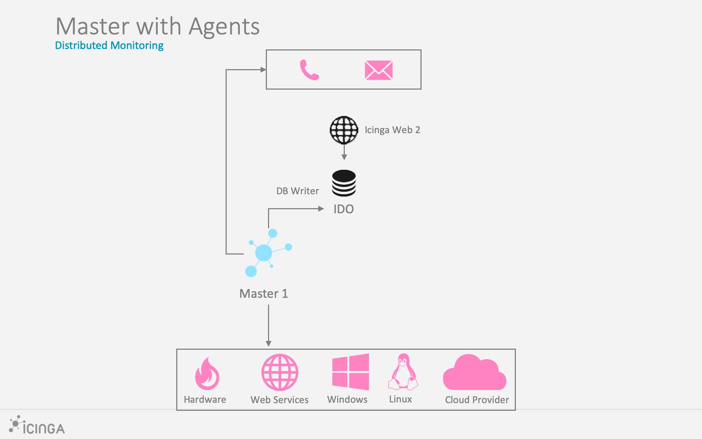

* `icinga2-master1.localdomain` is the primary master node.
* `icinga2-agent1.localdomain` and `icinga2-agent2.localdomain` are two child nodes as agents.

Setup requirements:

* Set up `icinga2-master1.localdomain` as [master](06-distributed-monitoring.md#distributed-monitoring-setup-master).
* Set up `icinga2-agent1.localdomain` and `icinga2-agent2.localdomain` as [agent](06-distributed-monitoring.md#distributed-monitoring-setup-agent-satellite).

Edit the `zones.conf` configuration file on the master:

```
[root@icinga2-master1.localdomain /]# vim /etc/icinga2/zones.conf

object Endpoint "icinga2-master1.localdomain" {
  // That's us
}

object Endpoint "icinga2-agent1.localdomain" {
  host = "192.168.56.111" // The master actively tries to connect to the agent
  log_duration = 0 // Disable the replay log for command endpoint agents
}

object Endpoint "icinga2-agent2.localdomain" {
  host = "192.168.56.112" // The master actively tries to connect to the agent
  log_duration = 0 // Disable the replay log for command endpoint agents
}

object Zone "master" {
  endpoints = [ "icinga2-master1.localdomain" ]
}

object Zone "icinga2-agent1.localdomain" {
  endpoints = [ "icinga2-agent1.localdomain" ]

  parent = "master"
}

object Zone "icinga2-agent2.localdomain" {
  endpoints = [ "icinga2-agent2.localdomain" ]

  parent = "master"
}

/* sync global commands */
object Zone "global-templates" {
  global = true
}
object Zone "director-global" {
  global = true
}
```

The two agent nodes do not need to know about each other. The only important thing
is that they know about the parent zone and their endpoint members (and optionally the global zone).

If you specify the `host` attribute in the `icinga2-master1.localdomain` endpoint object,
the agent will actively try to connect to the master node. Since you've specified the agent
endpoint's attribute on the master node already, you don't want the agents to connect to the
master. **Choose one [connection direction](06-distributed-monitoring.md#distributed-monitoring-advanced-hints-connection-direction).**

```
[root@icinga2-agent1.localdomain /]# vim /etc/icinga2/zones.conf

object Endpoint "icinga2-master1.localdomain" {
  // Do not actively connect to the master by leaving out the 'host' attribute
}

object Endpoint "icinga2-agent1.localdomain" {
  // That's us
}

object Zone "master" {
  endpoints = [ "icinga2-master1.localdomain" ]
}

object Zone "icinga2-agent1.localdomain" {
  endpoints = [ "icinga2-agent1.localdomain" ]

  parent = "master"
}

/* sync global commands */
object Zone "global-templates" {
  global = true
}
object Zone "director-global" {
  global = true
}
```
```
[root@icinga2-agent2.localdomain /]# vim /etc/icinga2/zones.conf

object Endpoint "icinga2-master1.localdomain" {
  // Do not actively connect to the master by leaving out the 'host' attribute
}

object Endpoint "icinga2-agent2.localdomain" {
  // That's us
}

object Zone "master" {
  endpoints = [ "icinga2-master1.localdomain" ]
}

object Zone "icinga2-agent2.localdomain" {
  endpoints = [ "icinga2-agent2.localdomain" ]

  parent = "master"
}

/* sync global commands */
object Zone "global-templates" {
  global = true
}
object Zone "director-global" {
  global = true
}
```

Now it is time to define the two agent hosts and apply service checks using
the command endpoint execution method on them. Note: You can also use the
config sync mode here.

Create a new configuration directory on the master node:

```
[root@icinga2-master1.localdomain /]# mkdir -p /etc/icinga2/zones.d/master
```

Add the two agent nodes as host objects:

```
[root@icinga2-master1.localdomain /]# cd /etc/icinga2/zones.d/master
[root@icinga2-master1.localdomain /etc/icinga2/zones.d/master]# vim hosts.conf

object Host "icinga2-agent1.localdomain" {
  check_command = "hostalive"
  address = "192.168.56.111"

  vars.agent_endpoint = name //follows the convention that host name == endpoint name
}

object Host "icinga2-agent2.localdomain" {
  check_command = "hostalive"
  address = "192.168.56.112"

  vars.agent_endpoint = name //follows the convention that host name == endpoint name
}
```

Add services using command endpoint checks:

```
[root@icinga2-master1.localdomain /etc/icinga2/zones.d/master]# vim services.conf

apply Service "ping4" {
  check_command = "ping4"

  //check is executed on the master node
  assign where host.address
}

apply Service "disk" {
  check_command = "disk"

  // Execute the check on the remote command endpoint
  command_endpoint = host.vars.agent_endpoint

  // Assign the service onto an agent
  assign where host.vars.agent_endpoint
}
```

Validate the configuration and restart Icinga 2 on the master node `icinga2-master1.localdomain`.

```
[root@icinga2-master1.localdomain /]# icinga2 daemon -C
[root@icinga2-master1.localdomain /]# systemctl restart icinga2
```

Open Icinga Web 2 and check the two newly created agent hosts with two new services
-- one executed locally (`ping4`) and one using command endpoint (`disk`).

> **Note**
>
> You don't necessarily need to add the agent endpoint/zone configuration objects
> into the master's zones.conf file. Instead, you can put them into `/etc/icinga2/zones.d/master`
> either in `hosts.conf` shown above, or in a new file called `agents.conf`.

> **Tip**:
>
> It's a good idea to add [health checks](06-distributed-monitoring.md#distributed-monitoring-health-checks)
to make sure that your cluster notifies you in case of failure.

In terms of health checks, consider adding the following for this scenario:

- Master node(s) check the connection to the agents
- Optional: Add dependencies for the agent host to prevent unwanted notifications when agents are unreachable

Proceed in [this chapter](06-distributed-monitoring.md#distributed-monitoring-health-checks-master-agents).

<!-- Keep this for compatibility -->
<a id="distributed-monitoring-scenarios-ha-master-clients"></a>

### High-Availability Master with Agents <a id="distributed-monitoring-scenarios-ha-master-agents"></a>

This scenario is similar to the one in the [previous section](06-distributed-monitoring.md#distributed-monitoring-master-agents). The only difference is that we will now set up two master nodes in a high-availability setup.
These nodes must be configured as zone and endpoints objects.

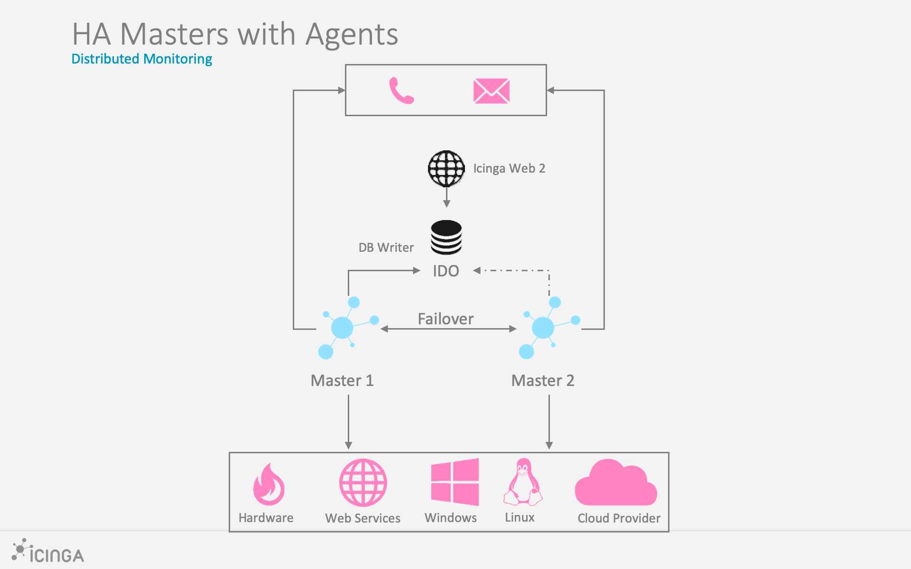

The setup uses the capabilities of the Icinga 2 cluster. All zone members
replicate cluster events between each other. In addition to that, several Icinga 2
features can enable [HA functionality](06-distributed-monitoring.md#distributed-monitoring-high-availability-features).

Best practice is to run the database backend on a dedicated server/cluster and
only expose a virtual IP address to Icinga and the IDO feature. By default, only one
endpoint will actively write to the backend then. Typical setups for MySQL clusters
involve Master-Master-Replication (Master-Slave-Replication in both directions) or Galera,
more tips can be found on our [community forums](https://community.icinga.com/).
The IDO object must have the same `instance_name` on all master nodes.

**Note**: All nodes in the same zone require that you enable the same features for high-availability (HA).

Overview:

* `icinga2-master1.localdomain` is the config master master node.
* `icinga2-master2.localdomain` is the secondary master master node without config in `zones.d`.
* `icinga2-agent1.localdomain` and `icinga2-agent2.localdomain` are two child nodes as agents.

Setup requirements:

* Set up `icinga2-master1.localdomain` as [master](06-distributed-monitoring.md#distributed-monitoring-setup-master).
* Set up `icinga2-master2.localdomain` as [satellite](06-distributed-monitoring.md#distributed-monitoring-setup-agent-satellite) (**we will modify the generated configuration**).
* Set up `icinga2-agent1.localdomain` and `icinga2-agent2.localdomain` as [agents](06-distributed-monitoring.md#distributed-monitoring-setup-agent-satellite) (when asked for adding multiple masters, set to `y` and add the secondary master `icinga2-master2.localdomain`).

In case you don't want to use the CLI commands, you can also manually create and sync the
required TLS certificates. We will modify and discuss all the details of the automatically generated configuration here.

Since there are now two nodes in the same zone, we must consider the
[high-availability features](06-distributed-monitoring.md#distributed-monitoring-high-availability-features).

* Checks and notifications are balanced between the two master nodes. That's fine, but it requires check plugins and notification scripts to exist on both nodes.
* The IDO feature will only be active on one node by default. Since all events are replicated between both nodes, it is easier to just have one central database.

One possibility is to use a dedicated MySQL cluster VIP (external application cluster)
and leave the IDO feature with enabled HA capabilities. Alternatively,
you can disable the HA feature and write to a local database on each node.
Both methods require that you configure Icinga Web 2 accordingly (monitoring
backend, IDO database, used transports, etc.).

> **Note**
>
> You can also start with a single master shown [here](06-distributed-monitoring.md#distributed-monitoring-master-agents) and later add
> the second master. This requires an extra step with the [initial sync](06-distributed-monitoring.md#distributed-monitoring-advanced-hints-initial-sync)
> for cloning the runtime state after done. Once done, proceed here.

In this scenario, we are not adding the agent configuration immediately
to the `zones.conf` file but will establish the hierarchy later.

The first master looks like this:

```
[root@icinga2-master1.localdomain /]# vim /etc/icinga2/zones.conf

object Endpoint "icinga2-master1.localdomain" {
  // That's us
}

object Endpoint "icinga2-master2.localdomain" {
  host = "192.168.56.102" // Actively connect to the secondary master
}

object Zone "master" {
  endpoints = [ "icinga2-master1.localdomain", "icinga2-master2.localdomain" ]
}

/* sync global commands */
object Zone "global-templates" {
  global = true
}
object Zone "director-global" {
  global = true
}
```

The secondary master waits for connection attempts from the first master,
and therefore does not try to connect to it again.

```
[root@icinga2-master1.localdomain /]# vim /etc/icinga2/zones.conf

object Endpoint "icinga2-master1.localdomain" {
  // That's us
}

object Endpoint "icinga2-master2.localdomain" {
  // The first master already connects to us
}

object Zone "master" {
  endpoints = [ "icinga2-master1.localdomain", "icinga2-master2.localdomain" ]
}

/* sync global commands */
object Zone "global-templates" {
  global = true
}
object Zone "director-global" {
  global = true
}
```

Restart both masters and ensure the initial connection and TLS handshake works.

The two agent nodes do not need to know about each other. The only important thing
is that they know about the parent zone and their endpoint members (and optionally about the global zone).

If you specify the `host` attribute in the `icinga2-master1.localdomain` and `icinga2-master2.localdomain`
endpoint objects, the agent will actively try to connect to the master node. Since we've specified the agent
endpoint's attribute on the master node already, we don't want the agent to connect to the
master nodes. **Choose one [connection direction](06-distributed-monitoring.md#distributed-monitoring-advanced-hints-connection-direction).**

```
[root@icinga2-agent1.localdomain /]# vim /etc/icinga2/zones.conf

object Endpoint "icinga2-master1.localdomain" {
  // Do not actively connect to the master by leaving out the 'host' attribute
}

object Endpoint "icinga2-master2.localdomain" {
  // Do not actively connect to the master by leaving out the 'host' attribute
}

object Endpoint "icinga2-agent1.localdomain" {
  // That's us
}

object Zone "master" {
  endpoints = [ "icinga2-master1.localdomain", "icinga2-master2.localdomain" ]
}

object Zone "icinga2-agent1.localdomain" {
  endpoints = [ "icinga2-agent1.localdomain" ]

  parent = "master"
}

/* sync global commands */
object Zone "global-templates" {
  global = true
}
object Zone "director-global" {
  global = true
}

```

```
[root@icinga2-agent2.localdomain /]# vim /etc/icinga2/zones.conf

object Endpoint "icinga2-master1.localdomain" {
  // Do not actively connect to the master by leaving out the 'host' attribute
}

object Endpoint "icinga2-master2.localdomain" {
  // Do not actively connect to the master by leaving out the 'host' attribute
}

object Endpoint "icinga2-agent2.localdomain" {
  //That's us
}

object Zone "master" {
  endpoints = [ "icinga2-master1.localdomain", "icinga2-master2.localdomain" ]
}

object Zone "icinga2-agent2.localdomain" {
  endpoints = [ "icinga2-agent2.localdomain" ]

  parent = "master"
}

/* sync global commands */
object Zone "global-templates" {
  global = true
}
object Zone "director-global" {
  global = true
}
```

Now it is time to define the two agent hosts and apply service checks using
the command endpoint execution method.

Create a new configuration directory on the master node `icinga2-master1.localdomain`.
**Note**: The secondary master node `icinga2-master2.localdomain` receives the
configuration using the [config sync mode](06-distributed-monitoring.md#distributed-monitoring-top-down-config-sync).

```
[root@icinga2-master1.localdomain /]# mkdir -p /etc/icinga2/zones.d/master
```

Add the two agent nodes with their zone/endpoint and host object configuration.

> **Note**
>
> In order to keep things in sync between the two HA masters,
> keep the `zones.conf` file as small as possible.
>
> You can create the agent zone and endpoint objects inside the
> master zone and have them synced to the secondary master.
> The cluster config sync enforces a reload allowing the secondary
> master to connect to the agents as well.

Edit the `zones.conf` file and ensure that the agent zone/endpoint objects
are **not** specified in there.

Then navigate into `/etc/icinga2/zones.d/master` and create a new file `agents.conf`.

```
[root@icinga2-master1.localdomain /]# cd /etc/icinga2/zones.d/master
[root@icinga2-master1.localdomain /etc/icinga2/zones.d/master]# vim agents.conf

//-----------------------------------------------
// Endpoints

object Endpoint "icinga2-agent1.localdomain" {
  host = "192.168.56.111" // The master actively tries to connect to the agent
  log_duration = 0 // Disable the replay log for command endpoint agents
}

object Endpoint "icinga2-agent2.localdomain" {
  host = "192.168.56.112" // The master actively tries to connect to the agent
  log_duration = 0 // Disable the replay log for command endpoint agents
}

//-----------------------------------------------
// Zones

object Zone "icinga2-agent1.localdomain" {
  endpoints = [ "icinga2-agent1.localdomain" ]

  parent = "master"
}

object Zone "icinga2-agent2.localdomain" {
  endpoints = [ "icinga2-agent2.localdomain" ]

  parent = "master"
}
```

Whenever you need to add an agent again, edit the mentioned files.

Next, create the corresponding host objects for the agents. Use the same names
for host and endpoint objects.

```
[root@icinga2-master1.localdomain /etc/icinga2/zones.d/master]# vim hosts.conf

object Host "icinga2-agent1.localdomain" {
  check_command = "hostalive"
  address = "192.168.56.111"
  vars.agent_endpoint = name //follows the convention that host name == endpoint name
}

object Host "icinga2-agent2.localdomain" {
  check_command = "hostalive"
  address = "192.168.56.112"
  vars.agent_endpoint = name //follows the convention that host name == endpoint name
}
```

Add services using command endpoint checks:

```
[root@icinga2-master1.localdomain /etc/icinga2/zones.d/master]# vim services.conf

apply Service "ping4" {
  check_command = "ping4"

  // Check is executed on the master node
  assign where host.address
}

apply Service "disk" {
  check_command = "disk"

  // Check is executed on the remote command endpoint
  command_endpoint = host.vars.agent_endpoint

  assign where host.vars.agent_endpoint
}
```

Validate the configuration and restart Icinga 2 on the master node `icinga2-master1.localdomain`.

```
[root@icinga2-master1.localdomain /]# icinga2 daemon -C
[root@icinga2-master1.localdomain /]# systemctl restart icinga2
```

Open Icinga Web 2 and check the two newly created agent hosts with two new services
-- one executed locally (`ping4`) and one using command endpoint (`disk`).

> **Tip**:
>
> It's a good idea to add [health checks](06-distributed-monitoring.md#distributed-monitoring-health-checks)
to make sure that your cluster notifies you in case of failure.

In terms of health checks, consider adding the following for this scenario:

- Master node(s) check the connection to the agents
- Optional: Add dependencies for the agent host to prevent unwanted notifications when agents are unreachable

Proceed in [this chapter](06-distributed-monitoring.md#distributed-monitoring-health-checks-master-agents).

<!-- Keep this for compatibility -->
<a id="distributed-monitoring-scenarios-master-satellite-client"></a>

### Three Levels with Masters, Satellites and Agents <a id="distributed-monitoring-scenarios-master-satellite-agents"></a>

This scenario combines everything you've learned so far: High-availability masters,
satellites receiving their configuration from the master zone, and agents checked via command
endpoint from the satellite zones.

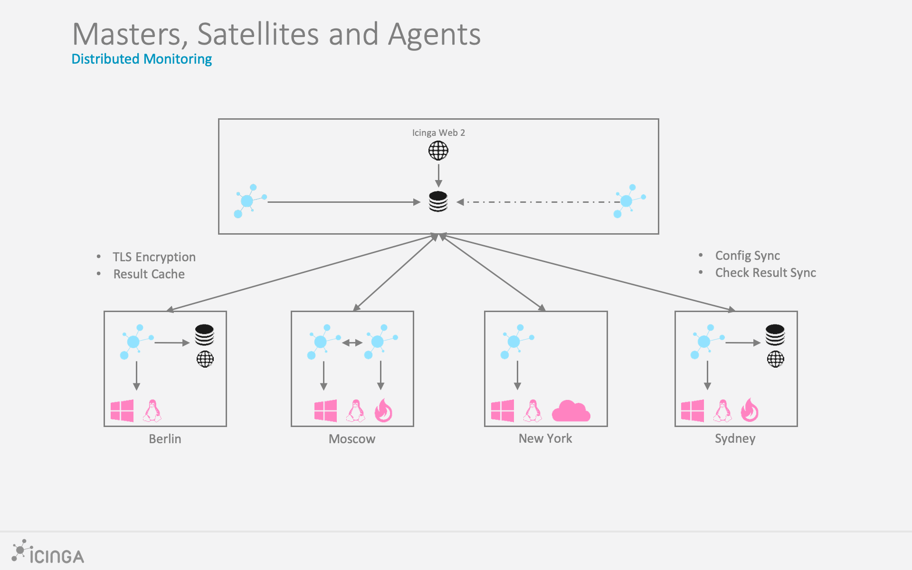

> **Tip**:
>
> It can get complicated, so grab a pen and paper and bring your thoughts to life.
> Play around with a test setup before using it in a production environment!

Best practice is to run the database backend on a dedicated server/cluster and
only expose a virtual IP address to Icinga and the IDO feature. By default, only one
endpoint will actively write to the backend then. Typical setups for MySQL clusters
involve Master-Master-Replication (Master-Slave-Replication in both directions) or Galera,
more tips can be found on our [community forums](https://community.icinga.com/).

Overview:

* `icinga2-master1.localdomain` is the configuration master master node.
* `icinga2-master2.localdomain` is the secondary master master node without configuration in `zones.d`.
* `icinga2-satellite1.localdomain` and `icinga2-satellite2.localdomain` are satellite nodes in a `master` child zone. They forward CSR signing requests to the master zone.
* `icinga2-agent1.localdomain` and `icinga2-agent2.localdomain` are two child nodes as agents.

Setup requirements:

* Set up `icinga2-master1.localdomain` as [master](06-distributed-monitoring.md#distributed-monitoring-setup-master).
* Set up `icinga2-master2.localdomain`, `icinga2-satellite1.localdomain` and `icinga2-satellite2.localdomain` as [agents](06-distributed-monitoring.md#distributed-monitoring-setup-agent-satellite) (we will modify the generated configuration).
* Set up `icinga2-agent1.localdomain` and `icinga2-agent2.localdomain` as [agents](06-distributed-monitoring.md#distributed-monitoring-setup-agent-satellite).

When being asked for the parent endpoint providing CSR auto-signing capabilities,
please add one of the satellite nodes. **Note**: This requires Icinga 2 v2.8+
and the `CA Proxy` on all master, satellite and agent nodes.

Example for `icinga2-agent1.localdomain`:

```
Please specify the parent endpoint(s) (master or satellite) where this node should connect to:
```

Parent endpoint is the first satellite `icinga2-satellite1.localdomain`:

```
Master/Satellite Common Name (CN from your master/satellite node): icinga2-satellite1.localdomain
Do you want to establish a connection to the parent node from this node? [Y/n]: y

Please specify the master/satellite connection information:
Master/Satellite endpoint host (IP address or FQDN): 192.168.56.105
Master/Satellite endpoint port [5665]: 5665
```

Add the second satellite `icinga2-satellite2.localdomain` as parent:

```
Add more master/satellite endpoints? [y/N]: y

Master/Satellite Common Name (CN from your master/satellite node): icinga2-satellite2.localdomain
Do you want to establish a connection to the parent node from this node? [Y/n]: y

Please specify the master/satellite connection information:
Master/Satellite endpoint host (IP address or FQDN): 192.168.56.106
Master/Satellite endpoint port [5665]: 5665

Add more master/satellite endpoints? [y/N]: n
```

The specified parent nodes will forward the CSR signing request to the master instances.

Proceed with adding the optional client ticket for [CSR auto-signing](06-distributed-monitoring.md#distributed-monitoring-setup-csr-auto-signing):

```
Please specify the request ticket generated on your Icinga 2 master (optional).
 (Hint: # icinga2 pki ticket --cn 'icinga2-agent1.localdomain'):
4f75d2ecd253575fe9180938ebff7cbca262f96e
```

In case you've chosen to use [On-Demand CSR Signing](06-distributed-monitoring.md#distributed-monitoring-setup-on-demand-csr-signing)
you can leave the ticket question blank.

Instead, Icinga 2 tells you to approve the request later on the master node.

```
No ticket was specified. Please approve the certificate signing request manually
on the master (see 'icinga2 ca list' and 'icinga2 ca sign --help' for details).
```

You can optionally specify a different bind host and/or port.

```
Please specify the API bind host/port (optional):
Bind Host []:
Bind Port []:
```

The next step asks you to accept configuration (required for [config sync mode](06-distributed-monitoring.md#distributed-monitoring-top-down-config-sync))
and commands (required for [command endpoint mode](06-distributed-monitoring.md#distributed-monitoring-top-down-command-endpoint)).

```
Accept config from parent node? [y/N]: y
Accept commands from parent node? [y/N]: y
```

Next you can optionally specify the local and parent zone names. This will be reflected
in the generated zone configuration file.

```
Local zone name [icinga2-agent1.localdomain]: icinga2-agent1.localdomain
```

Set the parent zone name to `satellite` for this agent.

```
Parent zone name [master]: satellite
```

You can add more global zones in addition to `global-templates` and `director-global` if necessary.
Press `Enter` or choose `n`, if you don't want to add any additional.

```
Reconfiguring Icinga...

Default global zones: global-templates director-global
Do you want to specify additional global zones? [y/N]: N
```

Last but not least the wizard asks you whether you want to disable the inclusion of the local configuration
directory in `conf.d`, or not. Defaults to disabled, since agents are checked via command endpoint and the example
configuration would collide with this mode.

```
Do you want to disable the inclusion of the conf.d directory [Y/n]: Y
Disabling the inclusion of the conf.d directory...
```


**We'll discuss the details of the required configuration below. Most of this
configuration can be rendered by the setup wizards.**

The zone hierarchy can look like this. We'll define only the directly connected zones here.

The master instances should actively connect to the satellite instances, therefore
the configuration on `icinga2-master1.localdomain` and `icinga2-master2.localdomain`
must include the `host` attribute for the satellite endpoints:

```
[root@icinga2-master1.localdomain /]# vim /etc/icinga2/zones.conf

object Endpoint "icinga2-master1.localdomain" {
  // That's us
}

object Endpoint "icinga2-master2.localdomain" {
  host = "192.168.56.102" // Actively connect to the second master.
}

object Endpoint "icinga2-satellite1.localdomain" {
  host = "192.168.56.105" // Actively connect to the satellites.
}

object Endpoint "icinga2-satellite2.localdomain" {
  host = "192.168.56.106" // Actively connect to the satellites.
}

object Zone "master" {
  endpoints = [ "icinga2-master1.localdomain", "icinga2-master2.localdomain" ]
}
```

The endpoint configuration on the secondary master looks similar,
but changes the connection attributes - the first master already
tries to connect, there is no need for a secondary attempt.

```
[root@icinga2-master2.localdomain /]# vim /etc/icinga2/zones.conf

object Endpoint "icinga2-master1.localdomain" {
  // First master already connects to us
}

object Endpoint "icinga2-master2.localdomain" {
  // That's us
}

object Endpoint "icinga2-satellite1.localdomain" {
  host = "192.168.56.105" // Actively connect to the satellites.
}

object Endpoint "icinga2-satellite2.localdomain" {
  host = "192.168.56.106" // Actively connect to the satellites.
}
```

The zone configuration on both masters looks the same. Add this
to the corresponding `zones.conf` entries for the endpoints.

```
object Zone "satellite" {
  endpoints = [ "icinga2-satellite1.localdomain", "icinga2-satellite2.localdomain" ]

  parent = "master"
}

/* sync global commands */
object Zone "global-templates" {
  global = true
}

object Zone "director-global" {
  global = true
}

```

In contrast to that, the satellite instances `icinga2-satellite1.localdomain`
and `icinga2-satellite2.localdomain` should not actively connect to the master
instances.

```
[root@icinga2-satellite1.localdomain /]# vim /etc/icinga2/zones.conf

object Endpoint "icinga2-master1.localdomain" {
  // This endpoint will connect to us
}

object Endpoint "icinga2-master2.localdomain" {
  // This endpoint will connect to us
}

object Endpoint "icinga2-satellite1.localdomain" {
  // That's us
}

object Endpoint "icinga2-satellite2.localdomain" {
  host = "192.168.56.106" // Actively connect to the secondary satellite
}
```

Again, only one side is required to establish the connection inside the HA zone.
Since satellite1 already connects to satellite2, leave out the `host` attribute
for `icinga2-satellite1.localdomain` on satellite2.

```
[root@icinga2-satellite2.localdomain /]# vim /etc/icinga2/zones.conf

object Endpoint "icinga2-master1.localdomain" {
  // This endpoint will connect to us
}

object Endpoint "icinga2-master2.localdomain" {
  // This endpoint will connect to us
}

object Endpoint "icinga2-satellite1.localdomain" {
  // First satellite already connects to us
}

object Endpoint "icinga2-satellite2.localdomain" {
  // That's us
}
```

The zone configuration on both satellites looks the same. Add this
to the corresponding `zones.conf` entries for the endpoints.

```
object Zone "master" {
  endpoints = [ "icinga2-master1.localdomain", "icinga2-master2.localdomain" ]
}

object Zone "satellite" {
  endpoints = [ "icinga2-satellite1.localdomain", "icinga2-satellite2.localdomain" ]

  parent = "master"
}

/* sync global commands */
object Zone "global-templates" {
  global = true
}

object Zone "director-global" {
  global = true
}
```

Keep in mind to control the endpoint [connection direction](06-distributed-monitoring.md#distributed-monitoring-advanced-hints-connection-direction)
using the `host` attribute, also for other endpoints in the same zone.

Since we want to use [top down command endpoint](06-distributed-monitoring.md#distributed-monitoring-top-down-command-endpoint) checks,
we must configure the agent endpoint and zone objects.

In order to minimize the effort, we'll sync the agent zone and endpoint configuration to the
satellites where the connection information is needed as well. Note: This only works with satellite
and agents, since there already is a trust relationship between the master and the satellite zone.
The cluster config sync to the satellite invokes an automated reload causing the agent connection attempts.

`icinga2-master1.localdomain` is the configuration master where everything is stored:

```
[root@icinga2-master1.localdomain /]# mkdir -p /etc/icinga2/zones.d/{master,satellite,global-templates}
[root@icinga2-master1.localdomain /]# cd /etc/icinga2/zones.d/satellite

[root@icinga2-master1.localdomain /etc/icinga2/zones.d/satellite]# vim icinga2-agent1.localdomain.conf

object Endpoint "icinga2-agent1.localdomain" {
  host = "192.168.56.111" // The satellite actively tries to connect to the agent
  log_duration = 0 // Disable the replay log for command endpoint agents
}

object Zone "icinga2-agent1.localdomain" {
  endpoints = [ "icinga2-agent1.localdomain" ]

  parent = "satellite"
}

[root@icinga2-master1.localdomain /etc/icinga2/zones.d/satellite]# vim icinga2-agent2.localdomain.conf

object Endpoint "icinga2-agent2.localdomain" {
  host = "192.168.56.112" // The satellite actively tries to connect to the agent
  log_duration = 0 // Disable the replay log for command endpoint agents
}

object Zone "icinga2-agent2.localdomain" {
  endpoints = [ "icinga2-agent2.localdomain" ]

  parent = "satellite"
}
```

The two agent nodes do not need to know about each other. The only important thing
is that they know about the parent zone (the satellite) and their endpoint members (and optionally the global zone).

> **Tipp**
>
> In the example above we've specified the `host` attribute in the agent endpoint configuration. In this mode,
> the satellites actively connect to the agents. This costs some resources on the satellite -- if you prefer to
> offload the connection attempts to the agent, or your DMZ requires this, you can also change the **[connection direction](06-distributed-monitoring.md#distributed-monitoring-advanced-hints-connection-direction).**
>
> 1) Don't set the `host` attribute for the agent endpoints put into `zones.d/satellite`.
> 2) Modify each agent's zones.conf file and add the `host` attribute to all parent satellites. You can automate this with using the `node wizard/setup` CLI commands.

The agents are waiting for the satellites to connect, therefore they don't specify
the `host` attribute in the endpoint objects locally.

Example for `icinga2-agent1.localdomain`:

```
[root@icinga2-agent1.localdomain /]# vim /etc/icinga2/zones.conf

object Endpoint "icinga2-satellite1.localdomain" {
  // Do not actively connect to the satellite by leaving out the 'host' attribute
}

object Endpoint "icinga2-satellite2.localdomain" {
  // Do not actively connect to the satellite by leaving out the 'host' attribute
}

object Endpoint "icinga2-agent1.localdomain" {
  // That's us
}

object Zone "satellite" {
  endpoints = [ "icinga2-satellite1.localdomain", "icinga2-satellite2.localdomain" ]
}

object Zone "icinga2-agent1.localdomain" {
  endpoints = [ "icinga2-agent1.localdomain" ]

  parent = "satellite"
}

/* sync global commands */
object Zone "global-templates" {
  global = true
}

object Zone "director-global" {
  global = true
}
```

Example for `icinga2-agent2.localdomain`:

```
[root@icinga2-agent2.localdomain /]# vim /etc/icinga2/zones.conf

object Endpoint "icinga2-satellite1.localdomain" {
  // Do not actively connect to the satellite by leaving out the 'host' attribute
}

object Endpoint "icinga2-satellite2.localdomain" {
  // Do not actively connect to the satellite by leaving out the 'host' attribute
}

object Endpoint "icinga2-agent2.localdomain" {
  // That's us
}

object Zone "satellite" {
  endpoints = [ "icinga2-satellite1.localdomain", "icinga2-satellite2.localdomain" ]
}

object Zone "icinga2-agent2.localdomain" {
  endpoints = [ "icinga2-agent2.localdomain" ]

  parent = "satellite"
}

/* sync global commands */
object Zone "global-templates" {
  global = true
}

object Zone "director-global" {
  global = true
}
```

Now it is time to define the two agents hosts on the master, sync them to the satellites
and apply service checks using the command endpoint execution method to them.
Add the two agent nodes as host objects to the `satellite` zone.

We've already created the directories in `/etc/icinga2/zones.d` including the files for the
zone and endpoint configuration for the agents.

```
[root@icinga2-master1.localdomain /]# cd /etc/icinga2/zones.d/satellite
```

Add the host object configuration for the `icinga2-agent1.localdomain` agent. You should
have created the configuration file in the previous steps and it should contain the endpoint
and zone object configuration already.

```
[root@icinga2-master1.localdomain /etc/icinga2/zones.d/satellite]# vim icinga2-agent1.localdomain.conf

object Host "icinga2-agent1.localdomain" {
  check_command = "hostalive"
  address = "192.168.56.111"

  vars.agent_endpoint = name // Follows the convention that host name == endpoint name
}
```

Add the host object configuration for the `icinga2-agent2.localdomain` agent configuration file:

```
[root@icinga2-master1.localdomain /etc/icinga2/zones.d/satellite]# vim icinga2-agent2.localdomain.conf

object Host "icinga2-agent2.localdomain" {
  check_command = "hostalive"
  address = "192.168.56.112"

  vars.agent_endpoint = name // Follows the convention that host name == endpoint name
}
```

Add a service object which is executed on the satellite nodes (e.g. `ping4`). Pin the apply rule to the `satellite` zone only.

```
[root@icinga2-master1.localdomain /etc/icinga2/zones.d/satellite]# vim services.conf

apply Service "ping4" {
  check_command = "ping4"

  // Check is executed on the satellite node
  assign where host.zone == "satellite" && host.address
}
```

Add services using command endpoint checks. Pin the apply rules to the `satellite` zone only.

```
[root@icinga2-master1.localdomain /etc/icinga2/zones.d/satellite]# vim services.conf

apply Service "disk" {
  check_command = "disk"

  // Execute the check on the remote command endpoint
  command_endpoint = host.vars.agent_endpoint

  assign where host.zone == "satellite" && host.vars.agent_endpoint
}
```

Validate the configuration and restart Icinga 2 on the master node `icinga2-master1.localdomain`.

```
[root@icinga2-master1.localdomain /]# icinga2 daemon -C
[root@icinga2-master1.localdomain /]# systemctl restart icinga2
```

Open Icinga Web 2 and check the two newly created agent hosts with two new services
-- one executed locally (`ping4`) and one using command endpoint (`disk`).

> **Tip**:
>
> It's a good idea to add [health checks](06-distributed-monitoring.md#distributed-monitoring-health-checks)
to make sure that your cluster notifies you in case of failure.

In terms of health checks, consider adding the following for this scenario:

- Master nodes check whether the satellite zone is connected
- Satellite nodes check the connection to the agents
- Optional: Add dependencies for the agent host to prevent unwanted notifications when agents are unreachable

Proceed in [this chapter](06-distributed-monitoring.md#distributed-monitoring-health-checks-master-satellite-agent).


## Best Practice <a id="distributed-monitoring-best-practice"></a>

We've put together a collection of configuration examples from community feedback.
If you like to share your tips and tricks with us, please join the [community channels](https://icinga.com/community/)!

### Global Zone for Config Sync <a id="distributed-monitoring-global-zone-config-sync"></a>

Global zones can be used to sync generic configuration objects
to all nodes depending on them. Common examples are:

* Templates which are imported into zone specific objects.
* Command objects referenced by Host, Service, Notification objects.
* Apply rules for services, notifications and dependencies.
* User objects referenced in notifications.
* Group objects.
* TimePeriod objects.

Plugin scripts and binaries must not be synced, this is for Icinga 2
configuration files only. Use your preferred package repository
and/or configuration management tool (Puppet, Ansible, Chef, etc.)
for keeping packages and scripts uptodate.

**Note**: Checkable objects (hosts and services) cannot be put into a global
zone. The configuration validation will terminate with an error. Apply rules
work as they are evaluated locally on each endpoint.

The zone object configuration must be deployed on all nodes which should receive
the global configuration files:

```
[root@icinga2-master1.localdomain /]# vim /etc/icinga2/zones.conf

object Zone "global-commands" {
  global = true
}
```

The default global zones generated by the setup wizards are called `global-templates` and `director-global`.

While you can should `global-templates` for your global configuration, `director-global` is reserved for use
by [Icinga Director](https://icinga.com/docs/director/latest/). Please don't
place any configuration in it manually.

Similar to the zone configuration sync you'll need to create a new directory in
`/etc/icinga2/zones.d`:

```
[root@icinga2-master1.localdomain /]# mkdir -p /etc/icinga2/zones.d/global-commands
```

Next, add a new check command, for example:

```
[root@icinga2-master1.localdomain /]# vim /etc/icinga2/zones.d/global-commands/web.conf

object CheckCommand "webinject" {
  //...
}
```

Restart the endpoints(s) which should receive the global zone before
before restarting the parent master/satellite nodes.

Then validate the configuration on the master node and restart Icinga 2.

**Tip**: You can copy the example configuration files located in `/etc/icinga2/conf.d`
into the default global zone `global-templates`.

Example:

```
[root@icinga2-master1.localdomain /]# cd /etc/icinga2/conf.d
[root@icinga2-master1.localdomain /etc/icinga2/conf.d]# cp {commands,groups,notifications,services,templates,timeperiods,users}.conf /etc/icinga2/zones.d/global-templates
```

### Health Checks <a id="distributed-monitoring-health-checks"></a>

In case of network failures or other problems, your monitoring might
either have late check results or just send out mass alarms for unknown
checks.

In order to minimize the problems caused by this, you should configure
additional health checks.

#### cluster-zone with Masters and Agents <a id="distributed-monitoring-health-checks-master-agents"></a>

The `cluster-zone` check will test whether the configured target zone is currently
connected or not. This example adds a health check for the [ha master with agents scenario](06-distributed-monitoring.md#distributed-monitoring-scenarios-ha-master-agents).

```
[root@icinga2-master1.localdomain /]# vim /etc/icinga2/zones.d/master/services.conf

apply Service "agent-health" {
  check_command = "cluster-zone"

  display_name = "cluster-health-" + host.name

  /* This follows the convention that the agent zone name is the FQDN which is the same as the host object name. */
  vars.cluster_zone = host.name

  assign where host.vars.agent_endpoint
}
```

In order to prevent unwanted notifications, add a service dependency which gets applied to
all services using the command endpoint mode.

```
[root@icinga2-master1.localdomain /]# vim /etc/icinga2/zones.d/master/dependencies.conf

apply Dependency "agent-health-check" to Service {
  parent_service_name = "agent-health"

  states = [ OK ] // Fail if the parent service state switches to NOT-OK
  disable_notifications = true

  assign where host.vars.agent_endpoint // Automatically assigns all agent endpoint checks as child services on the matched host
  ignore where service.name == "agent-health" // Avoid a self reference from child to parent
}
```

#### cluster-zone with Masters, Satellites and Agents <a id="distributed-monitoring-health-checks-master-satellite-agent"></a>

This example adds health checks for the [master, satellites and agents scenario](06-distributed-monitoring.md#distributed-monitoring-scenarios-master-satellite-agents).

Whenever the connection between the master and satellite zone breaks,
you may encounter late check results in Icinga Web. In order to view
this failure and also send notifications, add the following configuration:

First, add the two masters as host objects to the master zone, if not already
existing.

```
[root@icinga2-master1.localdomain /]# vim /etc/icinga2/zones.d/master/hosts.conf

object Host "icinga2-master1.localdomain" {
  check_command = "hostalive"

  address = "192.168.56.101"
}

object Host "icinga2-master2.localdomain" {
  check_command = "hostalive"

  address = "192.168.56.102"
}
```

Add service health checks against the satellite zone.

```
[root@icinga2-master1.localdomain /]# vim /etc/icinga2/zones.d/master/health.conf

apply Service "satellite-zone-health" {
  check_command = "cluster-zone"
  check_interval = 30s
  retry_interval = 10s

  vars.cluster_zone = "satellite"

  assign where match("icinga2-master*.localdomain", host.name)
}
```

**Don't forget to create notification apply rules for these services.**

Next are health checks for agents connected to the satellite zone.
Navigate into the satellite directory in `zones.d`:

```
[root@icinga2-master1.localdomain /]# cd /etc/icinga2/zones.d/satellite
```

You should already have configured agent host objects following [the master, satellite, agents scenario](06-distributed-monitoring.md#distributed-monitoring-scenarios-master-satellite-agents).
Add a new configuration file where all the health checks are defined.

```
[root@icinga2-master1.localdomain /etc/icinga2/zones.d/satellite]# vim health.conf

apply Service "agent-health" {
  check_command = "cluster-zone"

  display_name = "agent-health-" + host.name

  // This follows the convention that the agent zone name is the FQDN which is the same as the host object name.
  vars.cluster_zone = host.name

  // Create this health check for agent hosts in the satellite zone
  assign where host.zone == "satellite" && host.vars.agent_endpoint
}
```

In order to prevent unwanted notifications, add a service dependency which gets applied to
all services using the command endpoint mode.

```
[root@icinga2-master1.localdomain /etc/icinga2/zones.d/satellite]# vim health.conf

apply Dependency "agent-health-check" to Service {
  parent_service_name = "agent-health"

  states = [ OK ] // Fail if the parent service state switches to NOT-OK
  disable_notifications = true

  assign where host.zone == "satellite" && host.vars.agent_endpoint // Automatically assigns all agent endpoint checks as child services on the matched host
  ignore where service.name == "agent-health" // Avoid a self reference from child to parent
}
```

This is all done on the configuration master, and requires the scenario to be fully up and running.

#### Cluster Check

The `cluster` check will check if all endpoints in the current zone and the directly
connected zones are working properly. The disadvantage of using this check is that
you cannot monitor 3 or more cluster levels with it.

```
[root@icinga2-master1.localdomain /]# mkdir -p /etc/icinga2/zones.d/master
[root@icinga2-master1.localdomain /]# vim /etc/icinga2/zones.d/master/icinga2-master1.localdomain.conf

object Host "icinga2-master1.localdomain" {
  check_command = "hostalive"
  address = "192.168.56.101"
}

[root@icinga2-master1.localdomain /]# vim /etc/icinga2/zones.d/master/cluster.conf

object Service "cluster" {
  check_command = "cluster"
  check_interval = 5s
  retry_interval = 1s

  host_name = "icinga2-master1.localdomain"
}
```

### Pin Checks in a Zone <a id="distributed-monitoring-pin-checks-zone"></a>

In case you want to pin specific checks to their endpoints in a given zone you'll need to use
the `command_endpoint` attribute. This is reasonable if you want to
execute a local disk check in the `master` Zone on a specific endpoint then.

```
[root@icinga2-master1.localdomain /]# mkdir -p /etc/icinga2/zones.d/master
[root@icinga2-master1.localdomain /]# vim /etc/icinga2/zones.d/master/icinga2-master1.localdomain.conf

object Host "icinga2-master1.localdomain" {
  check_command = "hostalive"
  address = "192.168.56.101"
}

[root@icinga2-master1.localdomain /]# vim /etc/icinga2/zones.d/master/services.conf

apply Service "disk" {
  check_command = "disk"

  command_endpoint = host.name //requires a host object matching the endpoint object name e.g. icinga2-master1.localdomain

  assign where host.zone == "master" && match("icinga2-master*", host.name)
}
```

The `host.zone` attribute check inside the expression ensures that
the service object is only created for host objects inside the `master`
zone. In addition to that the [match](18-library-reference.md#global-functions-match)
function ensures to only create services for the master nodes.

### Windows Firewall <a id="distributed-monitoring-windows-firewall"></a>

#### ICMP Requests <a id="distributed-monitoring-windows-firewall-icmp"></a>

By default ICMP requests are disabled in the Windows firewall. You can
change that by [adding a new rule](https://support.microsoft.com/en-us/kb/947709).

```
C:\WINDOWS\system32>netsh advfirewall firewall add rule name="ICMP Allow incoming V4 echo request" protocol=icmpv4:8,any dir=in action=allow
```

#### Icinga 2 <a id="distributed-monitoring-windows-firewall-icinga2"></a>

If your master/satellite nodes should actively connect to the Windows agent
you'll also need to ensure that port `5665` is enabled.

```
C:\WINDOWS\system32>netsh advfirewall firewall add rule name="Open port 5665 (Icinga 2)" dir=in action=allow protocol=TCP localport=5665
```

#### NSClient++ API <a id="distributed-monitoring-windows-firewall-nsclient-api"></a>

If the [check_nscp_api](06-distributed-monitoring.md#distributed-monitoring-windows-nscp-check-api)
plugin is used to query NSClient++, you need to ensure that its port is enabled.

```
C:\WINDOWS\system32>netsh advfirewall firewall add rule name="Open port 8443 (NSClient++ API)" dir=in action=allow protocol=TCP localport=8443
```

For security reasons, it is advised to enable the NSClient++ HTTP API for local
connection from the Icinga agent only. Remote connections to the HTTP API
are not recommended with using the legacy HTTP API.

### Windows Agent and Plugins <a id="distributed-monitoring-windows-plugins"></a>

The Icinga 2 package on Windows already provides several plugins.
Detailed [documentation](10-icinga-template-library.md#windows-plugins) is available for all check command definitions.

Add the following `include` statement on all your nodes (master, satellite, agent):

```
vim /etc/icinga2/icinga2.conf

include <windows-plugins>
```

Based on the [master with agents](06-distributed-monitoring.md#distributed-monitoring-master-agents)
scenario we'll now add a local disk check.

First, add the agent node as host object:

```
[root@icinga2-master1.localdomain /]# cd /etc/icinga2/zones.d/master
[root@icinga2-master1.localdomain /etc/icinga2/zones.d/master]# vim hosts.conf

object Host "icinga2-agent2.localdomain" {
  check_command = "hostalive"
  address = "192.168.56.112"
  vars.agent_endpoint = name //follows the convention that host name == endpoint name
  vars.os_type = "windows"
}
```

Next, add the disk check using command endpoint checks (details in the
[disk-windows](10-icinga-template-library.md#windows-plugins-disk-windows) documentation):

```
[root@icinga2-master1.localdomain /etc/icinga2/zones.d/master]# vim services.conf

apply Service "disk C:" {
  check_command = "disk-windows"

  vars.disk_win_path = "C:"

  //specify where the check is executed
  command_endpoint = host.vars.agent_endpoint

  assign where host.vars.os_type == "windows" && host.vars.agent_endpoint
}
```

Validate the configuration and restart Icinga 2.

```
[root@icinga2-master1.localdomain /]# icinga2 daemon -C
[root@icinga2-master1.localdomain /]# systemctl restart icinga2
```

Open Icinga Web 2 and check your newly added Windows disk check :)

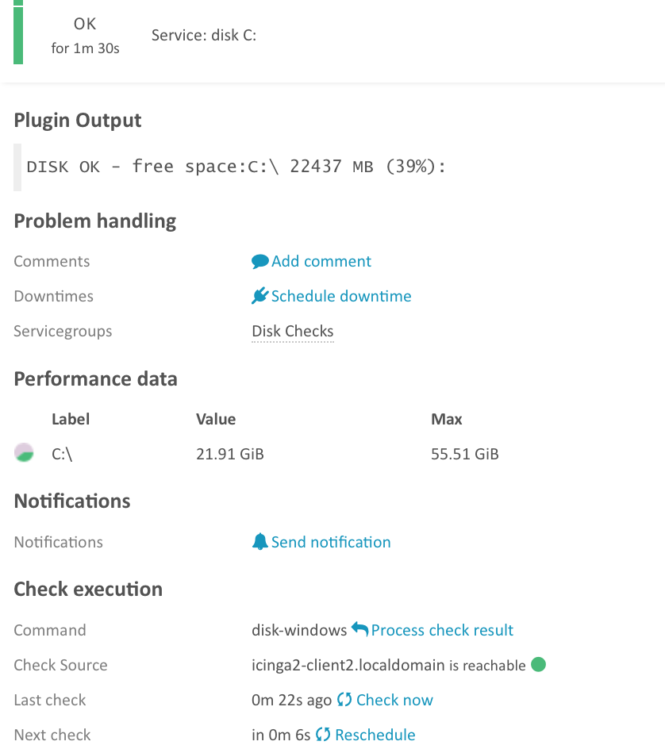

If you want to add your own plugins please check [this chapter](05-service-monitoring.md#service-monitoring-requirements)
for the requirements.

### Windows Agent and NSClient++ <a id="distributed-monitoring-windows-nscp"></a>

There are two methods available for querying NSClient++:

* Query the [HTTP API](06-distributed-monitoring.md#distributed-monitoring-windows-nscp-check-api) locally from an Icinga agent (requires a running NSClient++ service)
* Run a [local CLI check](06-distributed-monitoring.md#distributed-monitoring-windows-nscp-check-local) (does not require NSClient++ as a service)

Both methods have their advantages and disadvantages. One thing to
note: If you rely on performance counter delta calculations such as
CPU utilization, please use the HTTP API instead of the CLI sample call.

#### NSCLient++ with check_nscp_api <a id="distributed-monitoring-windows-nscp-check-api"></a>

The [Windows setup](06-distributed-monitoring.md#distributed-monitoring-setup-agent-windows) already allows
you to install the NSClient++ package. In addition to the Windows plugins you can
use the [nscp_api command](10-icinga-template-library.md#nscp-check-api) provided by the Icinga Template Library (ITL).

The initial setup for the NSClient++ API and the required arguments
is the described in the ITL chapter for the [nscp_api](10-icinga-template-library.md#nscp-check-api) CheckCommand.

Based on the [master with agents](06-distributed-monitoring.md#distributed-monitoring-master-agents)
scenario we'll now add a local nscp check which queries the NSClient++ API to check the free disk space.

Define a host object called `icinga2-agent2.localdomain` on the master. Add the `nscp_api_password`
custom variable and specify the drives to check.

```
[root@icinga2-master1.localdomain /]# cd /etc/icinga2/zones.d/master
[root@icinga2-master1.localdomain /etc/icinga2/zones.d/master]# vim hosts.conf

object Host "icinga2-agent1.localdomain" {
  check_command = "hostalive"
  address = "192.168.56.111"

  vars.agent_endpoint = name //follows the convention that host name == endpoint name
  vars.os_type = "Windows"
  vars.nscp_api_password = "icinga"
  vars.drives = [ "C:", "D:" ]
}
```

The service checks are generated using an [apply for](03-monitoring-basics.md#using-apply-for)
rule based on `host.vars.drives`:

```
[root@icinga2-master1.localdomain /etc/icinga2/zones.d/master]# vim services.conf

apply Service "nscp-api-" for (drive in host.vars.drives) {
  import "generic-service"

  check_command = "nscp_api"
  command_endpoint = host.vars.agent_endpoint

  //display_name = "nscp-drive-" + drive

  vars.nscp_api_host = "localhost"
  vars.nscp_api_query = "check_drivesize"
  vars.nscp_api_password = host.vars.nscp_api_password
  vars.nscp_api_arguments = [ "drive=" +  drive ]

  ignore where host.vars.os_type != "Windows"
}
```

Validate the configuration and restart Icinga 2.

```
[root@icinga2-master1.localdomain /]# icinga2 daemon -C
[root@icinga2-master1.localdomain /]# systemctl restart icinga2
```

Two new services ("nscp-drive-D:" and "nscp-drive-C:") will be visible in Icinga Web 2.

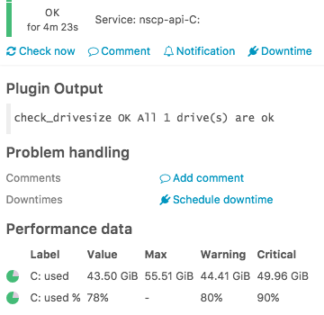

Note: You can also omit the `command_endpoint` configuration to execute
the command on the master. This also requires a different value for `nscp_api_host`
which defaults to `host.address`.

```
  //command_endpoint = host.vars.agent_endpoint

  //vars.nscp_api_host = "localhost"
```

You can verify the check execution by looking at the `Check Source` attribute
in Icinga Web 2 or the REST API.

If you want to monitor specific Windows services, you could use the following example:

```
[root@icinga2-master1.localdomain /]# cd /etc/icinga2/zones.d/master
[root@icinga2-master1.localdomain /etc/icinga2/zones.d/master]# vim hosts.conf

object Host "icinga2-agent1.localdomain" {
  check_command = "hostalive"
  address = "192.168.56.111"

  vars.agent_endpoint = name //follows the convention that host name == endpoint name
  vars.os_type = "Windows"
  vars.nscp_api_password = "icinga"
  vars.services = [ "Windows Update", "wscsvc" ]
}

[root@icinga2-master1.localdomain /etc/icinga2/zones.d/master]# vim services.conf

apply Service "nscp-api-" for (svc in host.vars.services) {
  import "generic-service"

  check_command = "nscp_api"
  command_endpoint = host.vars.agent_endpoint

  //display_name = "nscp-service-" + svc

  vars.nscp_api_host = "localhost"
  vars.nscp_api_query = "check_service"
  vars.nscp_api_password = host.vars.nscp_api_password
  vars.nscp_api_arguments = [ "service=" + svc ]

  ignore where host.vars.os_type != "Windows"
}
```

#### NSCLient++ with nscp-local <a id="distributed-monitoring-windows-nscp-check-local"></a>

The [Windows setup](06-distributed-monitoring.md#distributed-monitoring-setup-agent-windows) allows
you to install the bundled NSClient++ package. In addition to the Windows plugins you can
use the [nscp-local commands](10-icinga-template-library.md#nscp-plugin-check-commands)
provided by the Icinga Template Library (ITL).

Add the following `include` statement on all your nodes (master, satellite, agent):

```
vim /etc/icinga2/icinga2.conf

include <nscp>
```

The CheckCommand definitions will automatically determine the installed path
to the `nscp.exe` binary.

Based on the [master with agents](06-distributed-monitoring.md#distributed-monitoring-master-agents)
scenario we'll now add a local nscp check querying a given performance counter.

First, add the agent node as host object:

```
[root@icinga2-master1.localdomain /]# cd /etc/icinga2/zones.d/master
[root@icinga2-master1.localdomain /etc/icinga2/zones.d/master]# vim hosts.conf

object Host "icinga2-agent1.localdomain" {
  check_command = "hostalive"
  address = "192.168.56.111"

  vars.agent_endpoint = name //follows the convention that host name == endpoint name
  vars.os_type = "windows"
}
```

Next, add a performance counter check using command endpoint checks (details in the
[nscp-local-counter](10-icinga-template-library.md#nscp-check-local-counter) documentation):

```
[root@icinga2-master1.localdomain /etc/icinga2/zones.d/master]# vim services.conf

apply Service "nscp-local-counter-cpu" {
  check_command = "nscp-local-counter"
  command_endpoint = host.vars.agent_endpoint

  vars.nscp_counter_name = "\\Processor(_total)\\% Processor Time"
  vars.nscp_counter_perfsyntax = "Total Processor Time"
  vars.nscp_counter_warning = 1
  vars.nscp_counter_critical = 5

  vars.nscp_counter_showall = true

  assign where host.vars.os_type == "windows" && host.vars.agent_endpoint
}
```

Validate the configuration and restart Icinga 2.

```
[root@icinga2-master1.localdomain /]# icinga2 daemon -C
[root@icinga2-master1.localdomain /]# systemctl restart icinga2
```

Open Icinga Web 2 and check your newly added Windows NSClient++ check :)

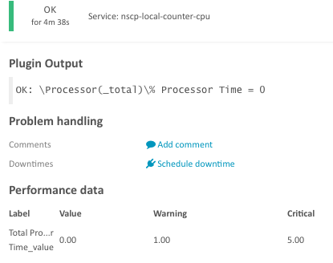

> **Tip**
>
> In order to measure CPU load, you'll need a running NSClient++ service.
> Therefore it is advised to use a local [nscp-api](06-distributed-monitoring.md#distributed-monitoring-windows-nscp-check-api)
> check against its REST API.

## Advanced Hints <a id="distributed-monitoring-advanced-hints"></a>

You can find additional hints in this section if you prefer to go your own route
with automating setups (setup, certificates, configuration).

### Certificate Auto-Renewal <a id="distributed-monitoring-certificate-auto-renewal"></a>

Icinga 2 v2.8+ added the possibility that nodes request certificate updates
on their own. If their expiration date is soon enough, they automatically
renew their already signed certificate by sending a signing request to the
parent node. You'll also see a message in the logs if certificate renewal
isn't necessary.

### High-Availability for Icinga 2 Features <a id="distributed-monitoring-high-availability-features"></a>

All nodes in the same zone require that you enable the same features for high-availability (HA).

By default, the following features provide advanced HA functionality:

* [Checks](06-distributed-monitoring.md#distributed-monitoring-high-availability-checks) (load balanced, automated failover).
* [Notifications](06-distributed-monitoring.md#distributed-monitoring-high-availability-notifications) (load balanced, automated failover).
* [DB IDO](06-distributed-monitoring.md#distributed-monitoring-high-availability-db-ido) (Run-Once, automated failover).
* [Elasticsearch](09-object-types.md#objecttype-elasticsearchwriter)
* [Gelf](09-object-types.md#objecttype-gelfwriter)
* [Graphite](09-object-types.md#objecttype-graphitewriter)
* [InfluxDB](09-object-types.md#objecttype-influxdbwriter)
* [OpenTsdb](09-object-types.md#objecttype-opentsdbwriter)
* [Perfdata](09-object-types.md#objecttype-perfdatawriter) (for PNP)

#### High-Availability with Checks <a id="distributed-monitoring-high-availability-checks"></a>

All instances within the same zone (e.g. the `master` zone as HA cluster) must
have the `checker` feature enabled.

Example:

```
# icinga2 feature enable checker
```

All nodes in the same zone load-balance the check execution. If one instance shuts down,
the other nodes will automatically take over the remaining checks.

#### High-Availability with Notifications <a id="distributed-monitoring-high-availability-notifications"></a>

All instances within the same zone (e.g. the `master` zone as HA cluster) must
have the `notification` feature enabled.

Example:

```
# icinga2 feature enable notification
```

Notifications are load-balanced amongst all nodes in a zone. By default this functionality
is enabled.
If your nodes should send out notifications independently from any other nodes (this will cause
duplicated notifications if not properly handled!), you can set `enable_ha = false`
in the [NotificationComponent](09-object-types.md#objecttype-notificationcomponent) feature.

#### High-Availability with DB IDO <a id="distributed-monitoring-high-availability-db-ido"></a>

All instances within the same zone (e.g. the `master` zone as HA cluster) must
have the DB IDO feature enabled.

Example DB IDO MySQL:

```
# icinga2 feature enable ido-mysql
```

By default the DB IDO feature only runs on one node. All other nodes in the same zone disable
the active IDO database connection at runtime. The node with the active DB IDO connection is
not necessarily the zone master.

**Note**: The DB IDO HA feature can be disabled by setting the `enable_ha` attribute to `false`
for the [IdoMysqlConnection](09-object-types.md#objecttype-idomysqlconnection) or
[IdoPgsqlConnection](09-object-types.md#objecttype-idopgsqlconnection) object on **all** nodes in the
**same** zone.

All endpoints will enable the DB IDO feature and connect to the configured
database and dump configuration, status and historical data on their own.

If the instance with the active DB IDO connection dies, the HA functionality will
automatically elect a new DB IDO master.

The DB IDO feature will try to determine which cluster endpoint is currently writing
to the database and bail out if another endpoint is active. You can manually verify that
by running the following query command:

```
icinga=> SELECT status_update_time, endpoint_name FROM icinga_programstatus;
   status_update_time   | endpoint_name
------------------------+---------------
 2016-08-15 15:52:26+02 | icinga2-master1.localdomain
(1 Zeile)
```

This is useful when the cluster connection between endpoints breaks, and prevents
data duplication in split-brain-scenarios. The failover timeout can be set for the
`failover_timeout` attribute, but not lower than 60 seconds.

### Endpoint Connection Direction <a id="distributed-monitoring-advanced-hints-connection-direction"></a>

Endpoints attempt to connect to another endpoint when its local [Endpoint](09-object-types.md#objecttype-endpoint) object
configuration specifies a valid `host` attribute (FQDN or IP address).

Example for the master node `icinga2-master1.localdomain` actively connecting
to the agent node `icinga2-agent1.localdomain`:

```
[root@icinga2-master1.localdomain /]# vim /etc/icinga2/zones.conf

//...

object Endpoint "icinga2-agent1.localdomain" {
  host = "192.168.56.111" // The master actively tries to connect to the agent
  log_duration = 0 // Disable the replay log for command endpoint agents
}
```

Example for the agent node `icinga2-agent1.localdomain` not actively
connecting to the master node `icinga2-master1.localdomain`:

```
[root@icinga2-agent1.localdomain /]# vim /etc/icinga2/zones.conf

//...

object Endpoint "icinga2-master1.localdomain" {
  // Do not actively connect to the master by leaving out the 'host' attribute
  log_duration = 0 // Disable the replay log for command endpoint agents
}
```

It is not necessary that both the master and the agent node establish
two connections to each other. Icinga 2 will only use one connection
and close the second connection if established. This generates useless
CPU cycles and leads to blocking resources when the connection times out.

**Tip**: Choose either to let master/satellite nodes connect to agent nodes
or vice versa.


### Disable Log Duration for Command Endpoints <a id="distributed-monitoring-advanced-hints-command-endpoint-log-duration"></a>

The replay log is a built-in mechanism to ensure that nodes in a distributed setup
keep the same history (check results, notifications, etc.) when nodes are temporarily
disconnected and then reconnect.

This functionality is not needed when a master/satellite node is sending check
execution events to an agent which is configured as [command endpoint](06-distributed-monitoring.md#distributed-monitoring-top-down-command-endpoint)
for check execution.

The [Endpoint](09-object-types.md#objecttype-endpoint) object attribute `log_duration` can
be lower or set to 0 to fully disable any log replay updates when the
agent is not connected.

Configuration on the master node `icinga2-master1.localdomain`:

```
[root@icinga2-master1.localdomain /]# vim /etc/icinga2/zones.conf

//...

object Endpoint "icinga2-agent1.localdomain" {
  host = "192.168.56.111" // The master actively tries to connect to the agent
  log_duration = 0
}

object Endpoint "icinga2-agent2.localdomain" {
  host = "192.168.56.112" // The master actively tries to connect to the agent
  log_duration = 0
}
```

Configuration on the agent `icinga2-agent1.localdomain`:

```
[root@icinga2-agent1.localdomain /]# vim /etc/icinga2/zones.conf

//...

object Endpoint "icinga2-master1.localdomain" {
  // Do not actively connect to the master by leaving out the 'host' attribute
  log_duration = 0
}

object Endpoint "icinga2-master2.localdomain" {
  // Do not actively connect to the master by leaving out the 'host' attribute
  log_duration = 0
}
```

### Initial Sync for new Endpoints in a Zone <a id="distributed-monitoring-advanced-hints-initial-sync"></a>

> **Note**
>
> This is required if you decide to change an already running single endpoint production
> environment into a HA-enabled cluster zone with two endpoints.
> The [initial setup](06-distributed-monitoring.md#distributed-monitoring-scenarios-ha-master-clients)
> with 2 HA masters doesn't require this step.

In order to make sure that all of your zone endpoints have the same state you need
to pick the authoritative running one and copy the following content:

* State file from `/var/lib/icinga2/icinga2.state`
* Internal config package for runtime created objects (downtimes, comments, hosts, etc.) at `/var/lib/icinga2/api/packages/_api`

If you need already deployed config packages from the Director, or synced cluster zones,
you can also sync the entire `/var/lib/icinga2/api/packages` directory. This directory should also be
included in your [backup strategy](02-installation.md#install-backup).

Do **not** sync `/var/lib/icinga2/api/zones*` manually - this is an internal directory
and handled by the Icinga cluster config sync itself.

> **Note**
>
> Ensure that all endpoints are shut down during this procedure. Once you have
> synced the cached files, proceed with configuring the remaining endpoints
> to let them know about the new master/satellite node (zones.conf).

### Manual Certificate Creation <a id="distributed-monitoring-advanced-hints-certificates-manual"></a>

#### Create CA on the Master <a id="distributed-monitoring-advanced-hints-certificates-manual-ca"></a>

Choose the host which should store the certificate authority (one of the master nodes).

The first step is the creation of the certificate authority (CA) by running the following command
as root user:

```
[root@icinga2-master1.localdomain /root]# icinga2 pki new-ca
```

#### Create CSR and Certificate <a id="distributed-monitoring-advanced-hints-certificates-manual-create"></a>

Create a certificate signing request (CSR) for the local instance:

```
[root@icinga2-master1.localdomain /root]# icinga2 pki new-cert --cn icinga2-master1.localdomain \
  --key icinga2-master1.localdomain.key \
  --csr icinga2-master1.localdomain.csr
```

Sign the CSR with the previously created CA:

```
[root@icinga2-master1.localdomain /root]# icinga2 pki sign-csr --csr icinga2-master1.localdomain.csr --cert icinga2-master1.localdomain
```

Repeat the steps for all instances in your setup.

#### Copy Certificates <a id="distributed-monitoring-advanced-hints-certificates-manual-copy"></a>

Copy the host's certificate files and the public CA certificate to `/var/lib/icinga2/certs`:

```
[root@icinga2-master1.localdomain /root]# mkdir -p /var/lib/icinga2/certs
[root@icinga2-master1.localdomain /root]# cp icinga2-master1.localdomain.{crt,key} /var/lib/icinga2/certs
[root@icinga2-master1.localdomain /root]# cp /var/lib/icinga2/ca/ca.crt /var/lib/icinga2/certs
```

Ensure that proper permissions are set (replace `icinga` with the Icinga 2 daemon user):

```
[root@icinga2-master1.localdomain /root]# chown -R icinga:icinga /var/lib/icinga2/certs
[root@icinga2-master1.localdomain /root]# chmod 600 /var/lib/icinga2/certs/*.key
[root@icinga2-master1.localdomain /root]# chmod 644 /var/lib/icinga2/certs/*.crt
```

The CA public and private key are stored in the `/var/lib/icinga2/ca` directory. Keep this path secure and include
it in your backups.

#### Create Multiple Certificates <a id="distributed-monitoring-advanced-hints-certificates-manual-multiple"></a>

Use your preferred method to automate the certificate generation process.

```
[root@icinga2-master1.localdomain /var/lib/icinga2/certs]# for node in icinga2-master1.localdomain icinga2-master2.localdomain icinga2-satellite1.localdomain; do icinga2 pki new-cert --cn $node --csr $node.csr --key $node.key; done
information/base: Writing private key to 'icinga2-master1.localdomain.key'.
information/base: Writing certificate signing request to 'icinga2-master1.localdomain.csr'.
information/base: Writing private key to 'icinga2-master2.localdomain.key'.
information/base: Writing certificate signing request to 'icinga2-master2.localdomain.csr'.
information/base: Writing private key to 'icinga2-satellite1.localdomain.key'.
information/base: Writing certificate signing request to 'icinga2-satellite1.localdomain.csr'.

[root@icinga2-master1.localdomain /var/lib/icinga2/certs]# for node in icinga2-master1.localdomain icinga2-master2.localdomain icinga2-satellite1.localdomain; do sudo icinga2 pki sign-csr --csr $node.csr --cert $node.crt; done
information/pki: Writing certificate to file 'icinga2-master1.localdomain.crt'.
information/pki: Writing certificate to file 'icinga2-master2.localdomain.crt'.
information/pki: Writing certificate to file 'icinga2-satellite1.localdomain.crt'.
```

Copy and move these certificates to the respective instances e.g. with SSH/SCP.

## Automation <a id="distributed-monitoring-automation"></a>

These hints should get you started with your own automation tools (Puppet, Ansible, Chef, Salt, etc.)
or custom scripts for automated setup.

These are collected best practices from various community channels.

* [Silent Windows setup](06-distributed-monitoring.md#distributed-monitoring-automation-windows-silent)
* [Node Setup CLI command](06-distributed-monitoring.md#distributed-monitoring-automation-cli-node-setup) with parameters

If you prefer an alternate method, we still recommend leaving all the Icinga 2 features intact (e.g. `icinga2 feature enable api`).
You should also use well known and documented default configuration file locations (e.g. `zones.conf`).
This will tremendously help when someone is trying to help in the [community channels](https://icinga.com/community/).


### Silent Windows Setup <a id="distributed-monitoring-automation-windows-silent"></a>

If you want to install the agent silently/unattended, use the `/qn` modifier. The
installation should not trigger a restart, but if you want to be completely sure, you can use the `/norestart` modifier.

```
C:> msiexec /i C:\Icinga2-v2.5.0-x86.msi /qn /norestart
```

Once the setup is completed you can use the `node setup` cli command too.

### Node Setup using CLI Parameters <a id="distributed-monitoring-automation-cli-node-setup"></a>

Instead of using the `node wizard` CLI command, there is an alternative `node setup`
command available which has some prerequisites.

**Note**: The CLI command can be used on Linux/Unix and Windows operating systems.
The graphical Windows setup wizard actively uses these CLI commands.

#### Node Setup on the Master Node <a id="distributed-monitoring-automation-cli-node-setup-master"></a>

In case you want to setup a master node you must add the `--master` parameter
to the `node setup` CLI command. In addition to that the `--cn` can optionally
be passed (defaults to the FQDN).

  Parameter           | Description
  --------------------|--------------------
  Common name (CN)    | **Optional.** Specified with the `--cn` parameter. By convention this should be the host's FQDN. Defaults to the FQDN.
  Zone name           | **Optional.** Specified with the `--zone` parameter. Defaults to `master`.
  Listen on           | **Optional.** Specified with the `--listen` parameter. Syntax is `host,port`.
  Disable conf.d      | **Optional.** Specified with the `disable-confd` parameter. If provided, this disables the `include_recursive "conf.d"` directive and adds the `api-users.conf` file inclusion to `icinga2.conf`. Available since v2.9+. Not set by default for compatibility reasons with Puppet, Ansible, Chef, etc.

Example:

```
[root@icinga2-master1.localdomain /]# icinga2 node setup --master
```

In case you want to bind the `ApiListener` object to a specific
host/port you can specify it like this:

```
--listen 192.68.56.101,5665
```

In case you don't need anything in `conf.d`, use the following command line:

```
[root@icinga2-master1.localdomain /]# icinga2 node setup --master --disable-confd
```

<!-- Keep this for compatibility -->
<a id="distributed-monitoring-automation-cli-node-setup-satellite-client"></a>

#### Node Setup with Agents/Satellites <a id="distributed-monitoring-automation-cli-node-setup-agent-satellite"></a>

Make sure that the `/var/lib/icinga2/certs` directory exists and is owned by the `icinga`
user (or the user Icinga 2 is running as).

```
[root@icinga2-agent1.localdomain /]# mkdir -p /var/lib/icinga2/certs
[root@icinga2-agent1.localdomain /]# chown -R icinga:icinga /var/lib/icinga2/certs
```

First you'll need to generate a new local self-signed certificate.
Pass the following details to the `pki new-cert` CLI command:

  Parameter           | Description
  --------------------|--------------------
  Common name (CN)    | **Required.** By convention this should be the host's FQDN.
  Client certificate files   | **Required.** These generated files will be put into the specified location (--key and --file). By convention this should be using `/var/lib/icinga2/certs` as directory.

Example:

```
[root@icinga2-agent1.localdomain /]# icinga2 pki new-cert --cn icinga2-agent1.localdomain \
--key /var/lib/icinga2/certs/icinga2-agent1.localdomain.key \
--cert /var/lib/icinga2/certs/icinga2-agent1.localdomain.crt
```

Request the master certificate from the master host (`icinga2-master1.localdomain`)
and store it as `trusted-master.crt`. Review it and continue.

Pass the following details to the `pki save-cert` CLI command:

  Parameter           | Description
  --------------------|--------------------
  Client certificate files | **Required.** Pass the previously generated files using the `--key` and `--cert` parameters.
  Trusted parent certificate | **Required.** Store the parent's certificate file. Manually verify that you're trusting it.
  Parent host         | **Required.** FQDN or IP address of the parent host.

Example:

```
[root@icinga2-agent1.localdomain /]# icinga2 pki save-cert --key /var/lib/icinga2/certs/icinga2-agent1.localdomain.key \
--cert /var/lib/icinga2/certs/icinga2-agent1.localdomain.crt \
--trustedcert /var/lib/icinga2/certs/trusted-parent.crt \
--host icinga2-master1.localdomain
```

Continue with the additional node setup step. Specify a local endpoint and zone name (`icinga2-agent1.localdomain`)
and set the master host (`icinga2-master1.localdomain`) as parent zone configuration. Specify the path to
the previously stored trusted master certificate.

Pass the following details to the `node setup` CLI command:

  Parameter           | Description
  --------------------|--------------------
  Common name (CN)    | **Optional.** Specified with the `--cn` parameter. By convention this should be the host's FQDN.
  Request ticket      | **Required.** Add the previously generated [ticket number](06-distributed-monitoring.md#distributed-monitoring-setup-csr-auto-signing).
  Trusted master certificate | **Required.** Add the previously fetched trusted master certificate (this step means that you've verified its origin).
  Parent host         | **Optional.** FQDN or IP address of the parent host. This is where the command connects for CSR signing. If not specified, you need to manually copy the parent's public CA certificate file into `/var/lib/icinga2/certs/ca.crt` in order to start Icinga 2.
  Parent endpoint     | **Required.** Specify the parent's endpoint name.
  Local zone name    | **Required.** Specify the agent/satellite zone name.
  Parent zone name    | **Optional.** Specify the parent's zone name.
  Accept config       | **Optional.** Whether this node accepts configuration sync from the master node (required for [config sync mode](06-distributed-monitoring.md#distributed-monitoring-top-down-config-sync)).
  Accept commands     | **Optional.** Whether this node accepts command execution messages from the master node (required for [command endpoint mode](06-distributed-monitoring.md#distributed-monitoring-top-down-command-endpoint)).
  Global zones        | **Optional.** Allows to specify more global zones in addition to `global-templates` and `director-global`.
  Disable conf.d      | **Optional.** Specified with the `disable-confd` parameter. If provided, this disables the `include_recursive "conf.d"` directive in `icinga2.conf`. Available since v2.9+. Not set by default for compatibility reasons with Puppet, Ansible, Chef, etc.

> **Note**
>
> The `master_host` parameter is deprecated and will be removed. Please use `--parent_host` instead.

Example:

```
[root@icinga2-agent1.localdomain /]# icinga2 node setup --ticket ead2d570e18c78abf285d6b85524970a0f69c22d \
--cn icinga2-agent1.localdomain \
--endpoint icinga2-master1.localdomain \
--zone icinga2-agent1.localdomain \
--parent_zone master \
--parent_host icinga2-master1.localdomain \
--trustedcert /var/lib/icinga2/certs/trusted-parent.crt \
--accept-commands --accept-config \
--disable-confd
```

In case the agent/satellite should connect to the master node, you'll
need to modify the `--endpoint` parameter using the format `cn,host,port`:

```
--endpoint icinga2-master1.localdomain,192.168.56.101,5665
```

Specify the parent zone using the `--parent_zone` parameter. This is useful
if the agent connects to a satellite, not the master instance.

```
--parent_zone satellite
```

In case the agent should know the additional global zone `linux-templates`, you'll
need to set the `--global-zones` parameter.

```
--global_zones linux-templates
```

The `--parent-host` parameter is optional since v2.9 and allows you to perform a connection-less setup.
You cannot restart Icinga 2 yet, the CLI command asked to to manually copy the parent's public CA
certificate file in `/var/lib/icinga2/certs/ca.crt`. Once Icinga 2 is started, it sends
a ticket signing request to the parent node. If you have provided a ticket, the master node
signs the request and sends it back to the agent/satellite which performs a certificate update in-memory.

In case you did not provide a ticket, you need to manually sign the CSR on the master node
which holds the CA's key pair.


**You can find additional best practices below.**

If this agent node is configured as [remote command endpoint execution](06-distributed-monitoring.md#distributed-monitoring-top-down-command-endpoint)
you can safely disable the `checker` feature. The `node setup` CLI command already disabled the `notification` feature.

```
[root@icinga2-agent1.localdomain /]# icinga2 feature disable checker
```

Disable "conf.d" inclusion if this is a [top down](06-distributed-monitoring.md#distributed-monitoring-top-down)
configured agent.

```
[root@icinga2-agent1.localdomain /]# sed -i 's/include_recursive "conf.d"/\/\/include_recursive "conf.d"/g' /etc/icinga2/icinga2.conf
```

**Note**: This is the default since v2.9.

**Optional**: Add an ApiUser object configuration for remote troubleshooting.

```
[root@icinga2-agent1.localdomain /]# cat <<EOF >/etc/icinga2/conf.d/api-users.conf
object ApiUser "root" {
  password = "agentsupersecretpassword"
  permissions = ["*"]
}
EOF
```

In case you've previously disabled the "conf.d" directory only
add the file file `conf.d/api-users.conf`:

```
[root@icinga2-agent1.localdomain /]# echo 'include "conf.d/api-users.conf"' >> /etc/icinga2/icinga2.conf
```

Finally restart Icinga 2.

```
[root@icinga2-agent1.localdomain /]# systemctl restart icinga2
```

Your automation tool must then configure master node in the meantime.

```
# cat <<EOF >>/etc/icinga2/zones.conf
object Endpoint "icinga2-agent1.localdomain" {
  // Agent connects itself
}

object Zone "icinga2-agent1.localdomain" {
  endpoints = [ "icinga2-agent1.localdomain" ]
  parent = "master"
}

EOF
```

## Using Multiple Environments <a id="distributed-monitoring-environments"></a>

> **Note**
>
> This documentation only covers the basics. Full functionality requires a not yet released addon.

In some cases it can be desired to run multiple Icinga instances on the same host.
Two potential scenarios include:

* Different versions of the same monitoring configuration (e.g. production and testing)
* Disparate sets of checks for entirely unrelated monitoring environments (e.g. infrastructure and applications)

The configuration is done with the global constants `ApiBindHost` and `ApiBindPort`
or the `bind_host` and `bind_port` attributes of the
[ApiListener](09-object-types.md#objecttype-apilistener) object.

The environment must be set with the global constant `Environment` or as object attribute
of the [IcingaApplication](09-object-types.md#objecttype-icingaapplication) object.

In any case the constant is default value for the attribute and the direct configuration in the objects
have more precedence. The constants have been added to allow the values being set from the CLI on startup.

When Icinga establishes a TLS connection to another cluster instance it automatically uses the [SNI extension](https://en.wikipedia.org/wiki/Server_Name_Indication)
to signal which endpoint it is attempting to connect to. On its own this can already be used to position multiple
Icinga instances behind a load balancer.

SNI example: `icinga2-agent1.localdomain`

However, if the environment is configured to `production`, Icinga appends the environment name to the SNI hostname like this:

SNI example with environment: `icinga2-agent1.localdomain:production`

Middleware like loadbalancers or TLS proxies can read the SNI header and route the connection to the appropriate target.
I.e., it uses a single externally-visible TCP port (usually 5665) and forwards connections to one or more Icinga
instances which are bound to a local TCP port. It does so by inspecting the environment name that is sent as part of the
SNI extension.
